# Аварийные политики и перепланирование

Промежуточная проверка. Значения относятся к конкретным реализациям и имеющимся повторам; это не итоговый выбор алгоритма.

Все динамические случаи используют один заранее замороженный начальный план OR-Tools Routing, а не собственные разные планы кандидатов. Момент события — 11:00. 30 завершённых/начатых действий неизменны; уже выехавший исполнитель освобождается в месте завершения защищённой работы. Три будущих клиентских визита защищены. В ручных событиях дополнительно фиксируются новый исполнитель или время. [Манифест сценариев](../datasets/dynamic-v1/manifest.json).

Покрытие считается по оставшейся очереди (172–174 заявки), штат — за весь день с учётом фиксированной части. Пробег и перемещения — только после события; они не выдаются за полный дневной пробег. Средняя реакция включает все оставшиеся аварии с их исходным временем появления. Реакция на единственную новую аварию выделена отдельно. Старые завершённые работы не считаются снятыми назначениями.

| Метод | Сценарий | Политика | Бюджет/seed | Статус | Назначено | Бригад | Реакция, средняя мин | Новая авария, мин | Нарушения |
|---|---|---|---|---|---:|---:|---:|---:|---:|
| alns | Отмена | Быстрая реакция | 5с / 1 | FEASIBLE | 172/172 | 24 | 277.18 | — | 0 |
| alns | Отмена | Минимальный штат | 5с / 1 | FEASIBLE | 172/172 | 22 | 333.38 | — | 0 |
| alns | Отмена | Первичный приоритет | 5с / 1 | FEASIBLE | 172/172 | 23 | 466.89 | — | 0 |
| alns | Начальный план | Быстрая реакция | 5с / 1 | FEASIBLE | 203/203 | 25 | 141.78 | — | 0 |
| alns | Начальный план | Минимальный штат | 5с / 1 | FEASIBLE | 203/203 | 22 | 228.53 | — | 0 |
| alns | Ручное назначение | Быстрая реакция | 5с / 1 | FEASIBLE | 173/173 | 25 | 268.02 | — | 0 |
| alns | Ручное назначение | Минимальный штат | 5с / 1 | FEASIBLE | 173/173 | 22 | 361.70 | — | 0 |
| alns | Ручное назначение | Первичный приоритет | 5с / 1 | FEASIBLE | 173/173 | 23 | 466.89 | — | 0 |
| alns | Ручное время | Быстрая реакция | 5с / 1 | FEASIBLE | 173/173 | 26 | 283.35 | — | 0 |
| alns | Ручное время | Минимальный штат | 5с / 1 | FEASIBLE | 173/173 | 22 | 341.23 | — | 0 |
| alns | Ручное время | Первичный приоритет | 5с / 1 | FEASIBLE | 173/173 | 24 | 466.89 | — | 0 |
| alns | Новая авария | Быстрая реакция | 5с / 1 | FEASIBLE | 174/174 | 25 | 258.21 | 7.73 | 0 |
| alns | Новая авария | Минимальный штат | 5с / 1 | FEASIBLE | 174/174 | 23 | 310.85 | 87.73 | 0 |
| alns | Новая авария | Первичный приоритет | 5с / 1 | FEASIBLE | 174/174 | 24 | 390.17 | 7.73 | 0 |
| alns | Недоступность бригады | Быстрая реакция | 5с / 1 | FEASIBLE | 173/173 | 27 | 274.01 | — | 0 |
| alns | Недоступность бригады | Минимальный штат | 5с / 1 | FEASIBLE | 173/173 | 24 | 376.57 | — | 0 |
| alns | Недоступность бригады | Первичный приоритет | 5с / 1 | FEASIBLE | 173/173 | 24 | 434.66 | — | 0 |
| timefold | Отмена | Быстрая реакция | 5с / 1 | FEASIBLE | 172/172 | 35 | 409.74 | — | 0 |
| timefold | Отмена | Минимальный штат | 5с / 1 | FEASIBLE | 172/172 | 24 | 409.19 | — | 0 |
| timefold | Отмена | Первичный приоритет | 5с / 1 | FEASIBLE | 172/172 | 24 | 463.65 | — | 0 |
| timefold | Начальный план | Быстрая реакция | 5с / 1 | FEASIBLE | 202/203 | 26 | 307.46 | — | 0 |
| timefold | Начальный план | Минимальный штат | 5с / 1 | FEASIBLE | 202/203 | 25 | 343.12 | — | 0 |
| timefold | Ручное назначение | Быстрая реакция | 5с / 1 | FEASIBLE | 173/173 | 33 | 370.07 | — | 0 |
| timefold | Ручное назначение | Минимальный штат | 5с / 1 | FEASIBLE | 173/173 | 24 | 441.18 | — | 0 |
| timefold | Ручное назначение | Первичный приоритет | 5с / 1 | FEASIBLE | 173/173 | 24 | 463.65 | — | 0 |
| timefold | Ручное время | Быстрая реакция | 5с / 1 | FEASIBLE | 173/173 | 31 | 407.52 | — | 0 |
| timefold | Ручное время | Минимальный штат | 5с / 1 | FEASIBLE | 173/173 | 24 | 416.39 | — | 0 |
| timefold | Ручное время | Первичный приоритет | 5с / 1 | FEASIBLE | 173/173 | 24 | 463.65 | — | 0 |
| timefold | Новая авария | Быстрая реакция | 5с / 1 | FEASIBLE | 174/174 | 35 | 385.25 | 489.77 | 0 |
| timefold | Новая авария | Минимальный штат | 5с / 1 | FEASIBLE | 174/174 | 25 | 406.22 | 523.12 | 0 |
| timefold | Новая авария | Первичный приоритет | 5с / 1 | FEASIBLE | 174/174 | 25 | 445.90 | 250.57 | 0 |
| timefold | Недоступность бригады | Быстрая реакция | 5с / 1 | FEASIBLE | 173/173 | 35 | 367.50 | — | 0 |
| timefold | Недоступность бригады | Минимальный штат | 5с / 1 | FEASIBLE | 173/173 | 25 | 409.43 | — | 0 |
| timefold | Недоступность бригады | Первичный приоритет | 5с / 1 | FEASIBLE | 173/173 | 25 | 441.58 | — | 0 |

## Покрытие оставшейся очереди, %

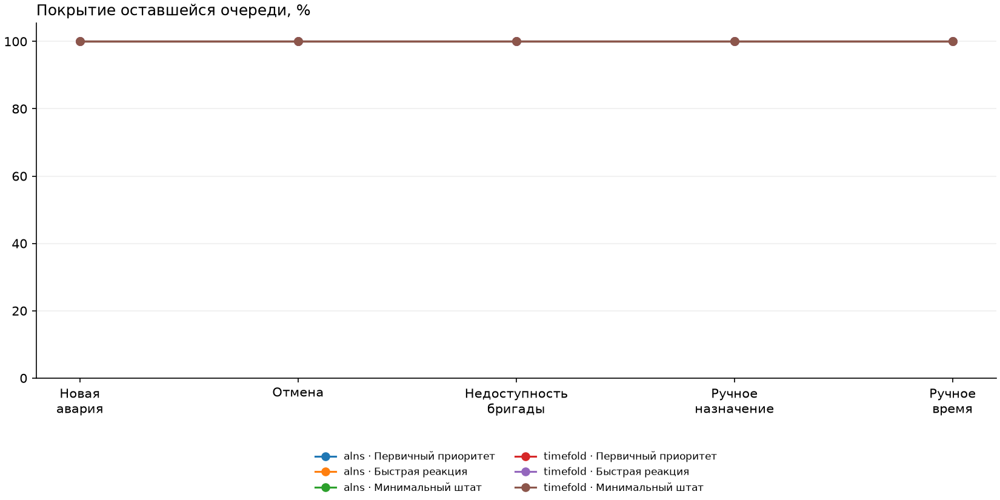

## Бригад за весь день

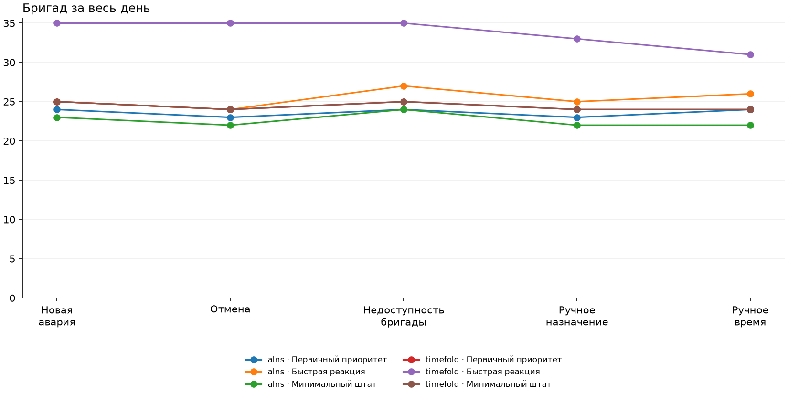

## Пробег после события, км

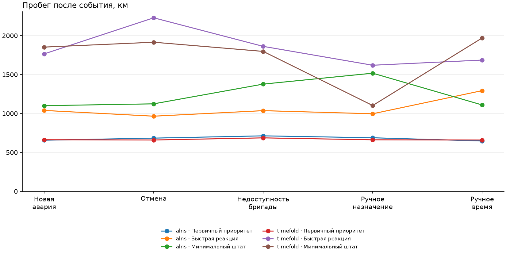

## Средняя реакция аварий, мин

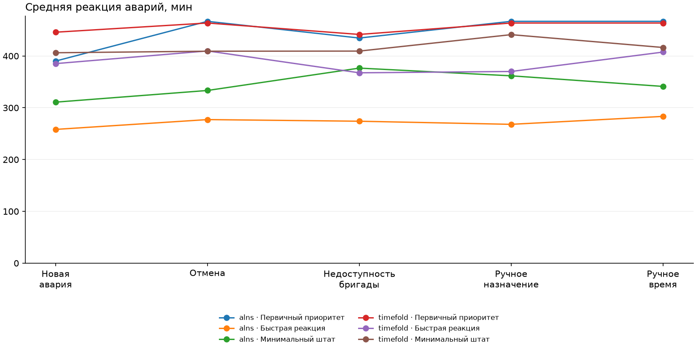

## Максимальная реакция аварий, мин

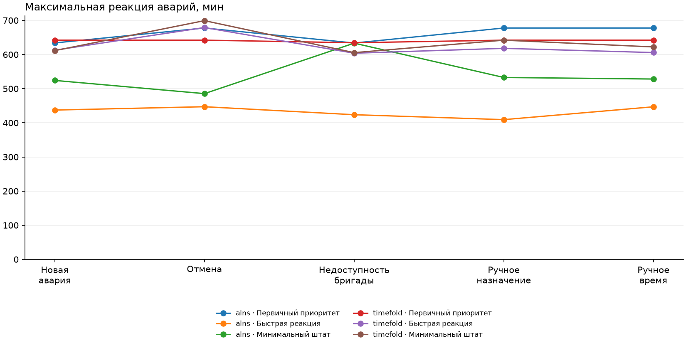

## Средняя задержка завершения аварий, мин

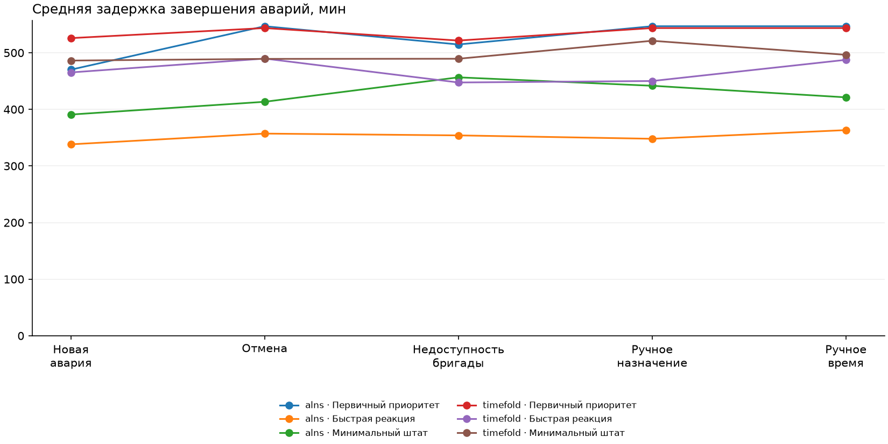

## Смена исполнителя

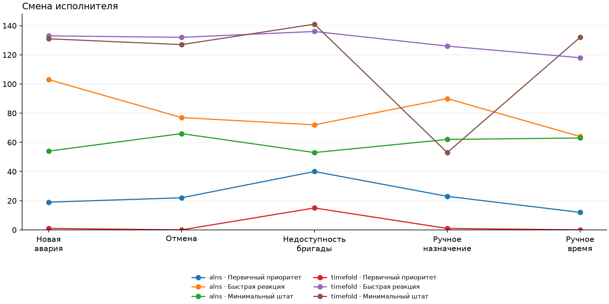

## Изменение порядка

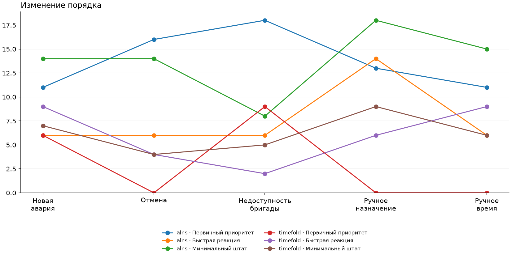

## Изменение времени

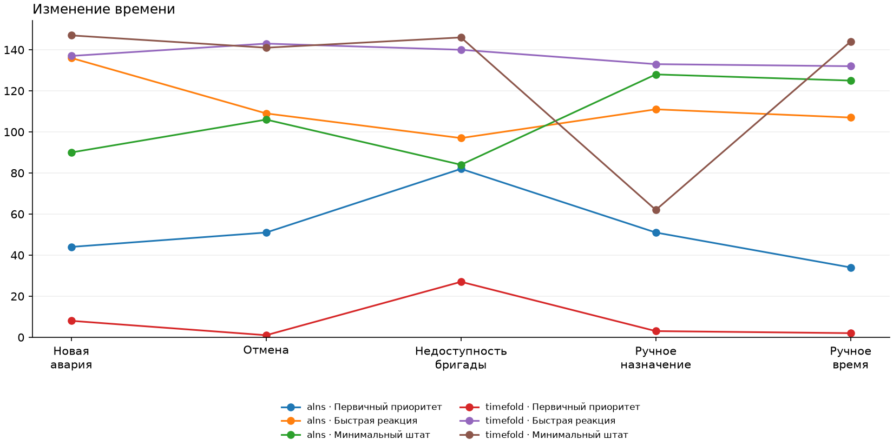

## Снятые назначения

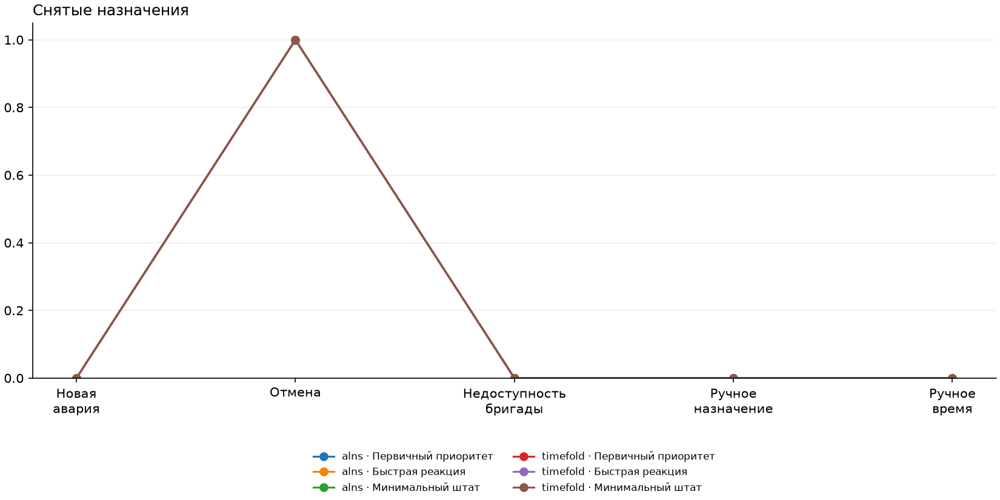

## Новые бригады относительно прежнего плана

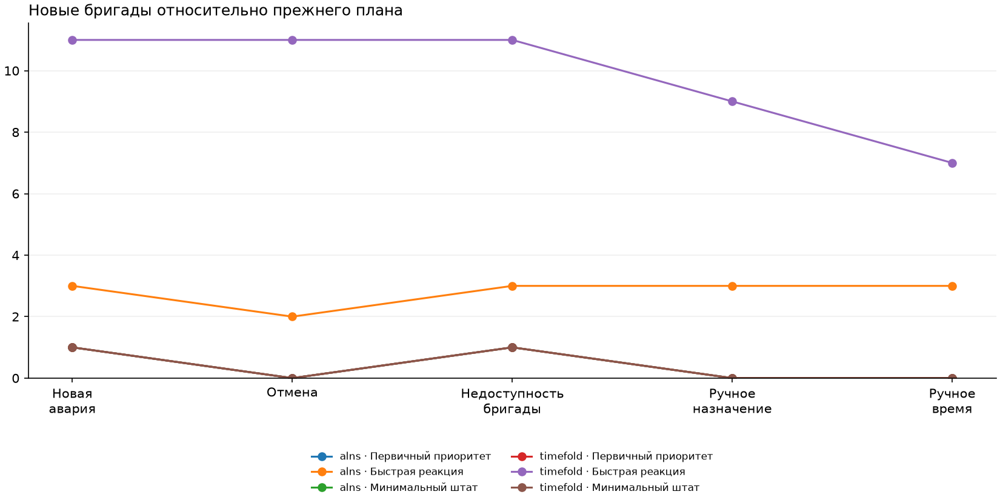

## Максимальный сдвиг, мин

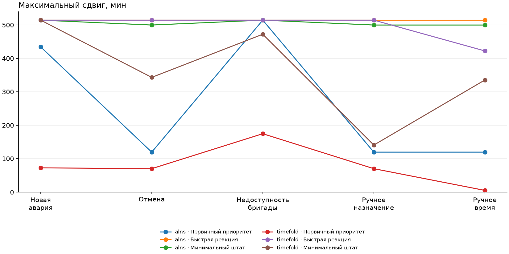

Графики показывают медианы только допустимых результатов. Пока число повторов и бюджеты следует читать в таблице: единственное наблюдение не измеряет устойчивость. Непроверенные адаптеры других кандидатов не объявляются неспособными поддержать эти функции.
