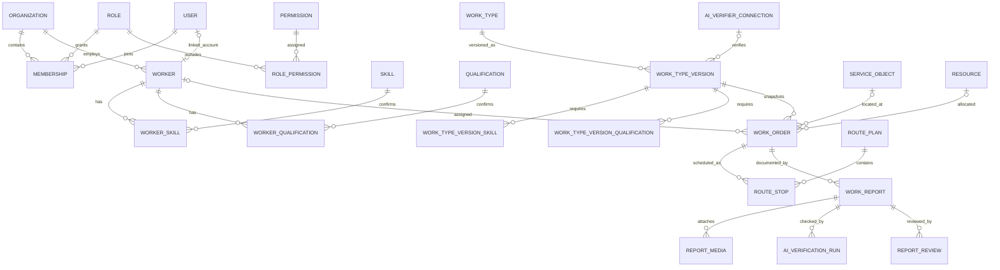

# Модель данных системы «Марш!»

Статус: базовая модель для backend и Cloudflare D1. Дата: 26 августа 2026 года.

## 1. Принципы

1. `User` отвечает за вход, а `Worker` — за карточку исполнителя. Исполнитель может существовать до выдачи ему учётной записи.
2. Доступ задаётся через `Membership`: один пользователь имеет одну роль внутри конкретной организации. Смена роли журналируется.
3. Тип работ имеет стабильную карточку `WorkType` и неизменяемые опубликованные версии `WorkTypeVersion`. Заявка всегда ссылается на конкретную версию требований.
4. Навыки и допуски исполнителя хранятся отдельно. Планировщик допускает назначение только при выполнении требований версии типа работ и при действующем сроке квалификации.
5. `completed` означает физическое завершение, `confirmed` — окончательную приёмку отчёта.
6. Фото и видео хранятся в закрытом объектном хранилище; D1 содержит только метаданные, контрольную сумму и ключ объекта.
7. Все даты и время сохраняются в UTC как ISO-8601. Часовой пояс организации применяется только при вводе и отображении.

## 2. Основные связи



## 3. Контуры модели

| Контур | Таблицы | Назначение |
|---|---|---|
| Авторизация | `users`, `sessions`, `auth_login_attempts` | Email/пароль, сессии и защита от перебора |
| Организация и права | `organizations`, `roles`, `permissions`, `role_permissions`, `memberships` | Изоляция организаций и RBAC |
| Исполнители | `service_areas`, `workers`, `skills`, `qualifications`, `worker_skills`, `worker_qualifications` | Карточки сотрудников и подтверждённые компетенции |
| Ресурсы | `resources` | Транспорт/оборудование, состояние и текущее назначение |
| Типы работ | `work_types`, `work_type_versions`, `work_type_version_skills`, `work_type_version_qualifications` | Версионируемые требования и способ проверки отчёта |
| ИИ-проверка | `ai_verifier_connections`, `ai_verification_runs` | Настройки внешних моделей и история вызовов |
| Заявки | `service_objects`, `work_orders`, `work_order_status_history` | Работы, адресные снимки, исполнитель и история статусов |
| Планирование | `route_plans`, `route_stops` | Дневной план, последовательность выездов и время в пути |
| Отчётность | `work_reports`, `report_media`, `report_reviews` | Ревизии отчётов, фото/видео и решения проверяющего |
| Аудит | `audit_events` | Неизменяемый журнал значимых действий |

## 4. Ключевые ограничения

- `memberships(organization_id, user_id)` уникален: у пользователя одна роль в организации.
- Роль в `memberships` должна принадлежать той же организации; это проверяет сервисный слой в одной транзакции.
- У одного пользователя не более одной связанной карточки исполнителя.
- Опубликованная `work_type_version` не изменяется. Редактирование создаёт следующую версию.
- Для `verification_mode = dispatcher` связь с ИИ-моделью пуста; для `ai_model` она обязательна.
- Требования типа работ задаются таблицами связей, а не строками или JSON.
- Номер заявки уникален внутри организации.
- `work_reports(work_order_id, revision)` уникален; отправленная ревизия неизменяема.
- Статус `confirmed` разрешён только после принятого `report_review`.
- Все изменения ролей, подтверждение заявки, ручное изменение плана и решения по отчёту записываются в `audit_events`.

## 5. Жизненный цикл заявки и отчёта

```text
Заявка: new → assigned → en_route → in_progress → completed → confirmed
Отчёт: draft → submitted → manual_review → accepted
                            ↘ changes_requested → новая ревизия
        draft → submitted → ai_queued → ai_review → accepted
                                                ↘ manual_review
```

ИИ-результат `not_accepted`, ошибка или timeout не закрывают заявку, а переводят отчёт диспетчеру. Только `accepted` создаёт окончательное подтверждение.

## 6. Правила сервисного слоя

- Каждая команда принимает `organizationId` из доверенного серверного контекста, а не из клиентской формы.
- Назначение исполнителя проверяет активность, смену, участок, все навыки и неистёкшие квалификации.
- Создание заявки фиксирует `workTypeVersionId` и снимок адреса, чтобы последующие изменения справочников не переписали историю.
- Изменение роли сначала сравнивает текущую и новую роль, затем требует подтверждение и записывает аудит.
- Публикация плана и подтверждение отчёта выполняются транзакционно вместе с записью истории/аудита.
- JSON используется только для версионируемых схем отчёта, политик доказательств и payload аудита; основные связи нормализованы.

## 7. Соответствие текущему прототипу

Текущие массивы данных интерфейса остаются демонстрационными. При подключении API они заменяются репозиториями над D1 без изменения форм. Значения UI `administrator` и `executor` отображаются на доменные роли `org_admin` и `performer`. Поле `users.role` временно сохранено для совместимости действующей авторизации; источником прав после подключения backend становится `memberships.role_id`.
