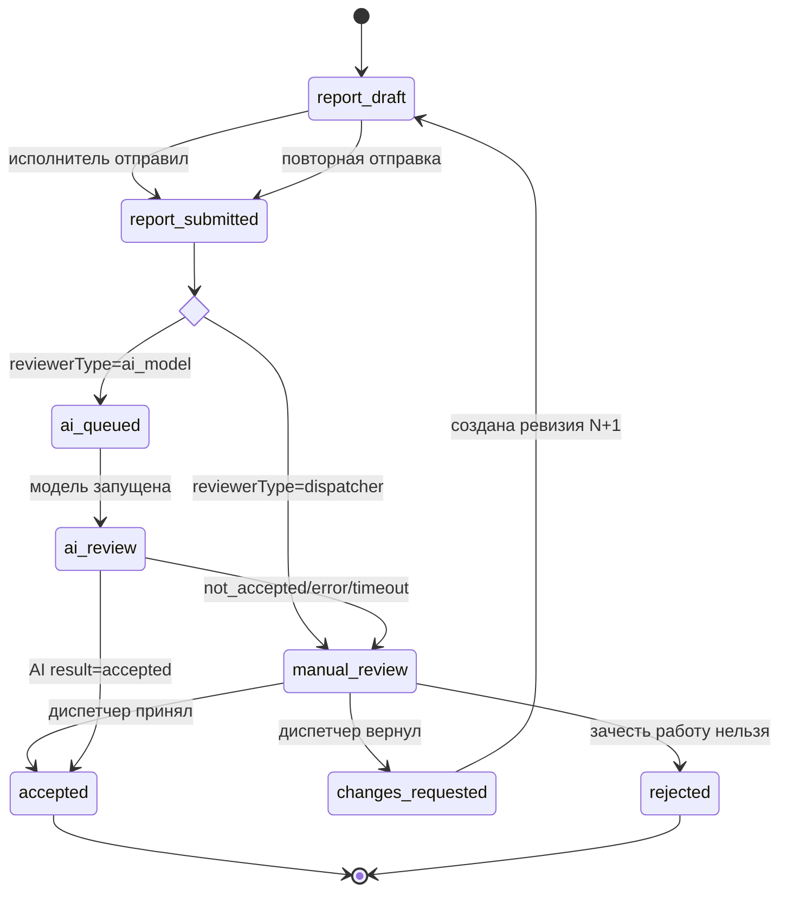
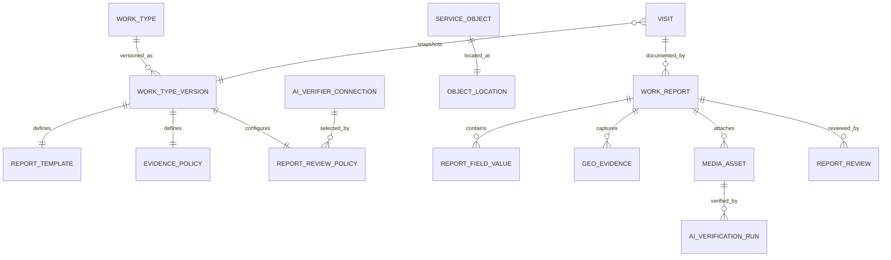
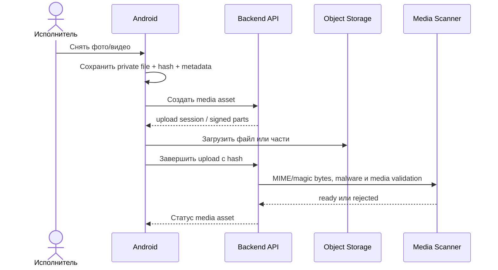

# FSM-отчётность, геофиксация и внешняя ИИ-проверка

Дата проектирования: 19 августа 2026 года.  
Статус: концепция дополнительного модуля; не входит в обязательный объём базового MVP. Документ расширяет `IDENTITY_AND_ANDROID_MVP.md` и используется для дополнительного предложения заказчику.

Решения и открытые вопросы этого документа не блокируют MVP регистрации, планирования, Android-приложения и push-уведомлений. Реализация начинается только после отдельного включения FSM-модуля в объём задачи.

## 1. Цель и границы

Система должна закрывать не только планирование визита, но и полевой цикл Field Service Management:

1. исполнитель получает назначение;
2. прибывает на объект и фиксирует геопозицию;
3. выполняет работу;
4. заполняет отчёт по шаблону вида работ;
5. прикладывает обязательные фото и/или видео;
6. система направляет отчёт выбранному для этого вида работ проверяющему;
7. отчёт проверяет либо диспетчер, либо выбранная администратором внешняя модель через API;
8. ответ модели `accepted` автоматически закрывает задачу, а `not_accepted` передаёт отчёт диспетчеру;
9. только принятый отчёт закрывает визит в учётном смысле.

Первичный способ проверки является частью версии вида работ: `dispatcher` или `ai_model`. В AI-режиме система не обучает модель и не реализует её предметную логику — только отправляет согласованный пакет данных по API и получает бинарный ответ `accepted | not_accepted`.

## 2. Разделение состояний визита и отчёта

Физическое выполнение работы и документальное закрытие — разные процессы. Если диспетчер рассматривает отчёт несколько часов, исполнитель не должен всё это время считаться занятым на объекте.

### 2.1. Состояние выполнения визита

`assigned → accepted → en_route → arrived → in_progress → work_finished`

Альтернативные переходы: `problem`, `cancelled`, `no_access`. После `work_finished` визит считается физически завершённым для планировщика, но ещё не закрытым для учёта.

### 2.2. Состояние закрытия

После `report_submitted` маршрут зависит от `reviewerType`, зафиксированного в `WorkTypeVersion`:

- `dispatcher`: `report_submitted → manual_review → accepted | changes_requested`;
- `ai_model`: `report_submitted → ai_queued → ai_review → accepted | manual_review`.

После `changes_requested` исполнитель создаёт следующую ревизию и повторно отправляет её тому же типу проверяющего. `rejected` — конечное исключительное состояние для заведомо недействительного отчёта или невозможности зачесть работу, а не обычный способ исправить замечания.



Техническое состояние вызова хранится отдельно: `not_required`, `queued`, `running`, `succeeded`, `failed`, `cancelled`. `not_accepted`, timeout, невалидный ответ и исчерпание retry не закрывают задачу — отчёт переходит в обычную очередь диспетчера с причиной маршрутизации. Для демонстрации дополнительного модуля используется подключение-заглушка `always_not_accepted`, поэтому AI-ветка всегда безопасно заканчивается ручной проверкой.

## 3. Доменная модель



### 3.1. Основные сущности

| Сущность | Назначение | Ключевые данные |
|---|---|---|
| `work_types` | Стабильный идентификатор вида работ | код, название, организация, active |
| `work_type_versions` | Неизменяемая опубликованная версия настроек | версия, template, geo/media/review policy, published by/at |
| `report_templates` | Поля отчёта и проверки заполнения | типы полей, обязательность, диапазоны, справочники |
| `service_objects` | Обслуживаемый объект | адрес, клиентский идентификатор, актуальная координата |
| `object_locations` | Версионируемая эталонная геоточка | lat/lon, источник, статус проверки, автор и время |
| `work_reports` | Отчёт по конкретному визиту | revision, status, worker, work type version, submitted at |
| `geo_evidence` | Разовая фактическая позиция устройства | lat/lon, accuracy, captured/received at, source, anomaly flags |
| `media_assets` | Фото или видео и его жизненный цикл | kind, object key, hash, MIME, size, capture metadata, status |
| `ai_verifier_connections` | Подключение к API модели заказчика | organization, name, endpoint, auth/secret reference, status |
| `ai_verification_runs` | Воспроизводимый вызов внешней проверки | connection snapshot, request id/hash, binary result, timing/error |
| `report_reviews` | Решение выбранного проверяющего | actor type/id или AI run, decision, reason, report revision, created at |

Визит хранит ссылку на конкретный `work_type_version`. Редактирование настроек вида работ создаёт новую версию и не меняет требования к уже назначенным визитам и отправленным отчётам.

## 4. Настройки вида работ

В пользовательском интерфейсе это раздел **«Администрирование → Виды работ»**. Для каждого вида работ администратор задаёт:

### 4.1. Шаблон отчёта

- обязательные текстовые и числовые поля;
- справочники и чек-листы;
- выполненные операции и использованные материалы;
- комментарий исполнителя;
- признак необходимости подписи/кода клиента в будущих версиях;
- правила условной обязательности, например «при результате `неисправность` обязателен комментарий».

Шаблон хранится как валидируемая сервером схема. Клиентское приложение строит форму по схеме, но сервер повторяет все проверки при отправке.

### 4.2. Геополитика

- какие события требуют координату: `arrival`, `work_finished`, `report_submit`, `photo_capture`;
- требуется ли точная координата или достаточно приблизительной;
- максимально допустимая погрешность;
- допустимый радиус от эталонной точки объекта;
- разрешена ли отправка с отклонением и обязательной причиной;
- как обработать геоаномалию: заблокировать отправку, потребовать причину или разрешить с флагом для выбранного проверяющего/администратора.

Для первого прототипа дополнительного модуля координата запрашивается при `arrival` и при отправке отчёта. Непрерывного фонового трекинга нет.

### 4.3. Медиаполитика

Для каждой категории доказательства (`before`, `after`, `serial_number`, `defect`, `overview`, произвольная категория) задаются:

- тип: photo/video;
- минимальное и максимальное количество;
- обязательность;
- источник: только камера или камера/системный Photo Picker;
- максимальный размер, длительность видео и допустимые MIME-типы;
- нужен ли звук в видео;
- требуется ли геопозиция в момент съёмки;
- подпись/инструкция, показываемая исполнителю;
- должна ли фотография этой категории передаваться внешнему verifier API.

Для доказательных кадров рекомендуется `camera_only`. Photo Picker допустим только для видов работ, где загрузка ранее сделанного материала разрешена бизнес-процессом.

### 4.4. Выбор проверяющего

Администратор обязан выбрать для версии вида работ ровно один режим:

```text
reviewerType = dispatcher | ai_model
```

- `dispatcher` — каждый отчёт этого вида работ попадает в ручную очередь и решение принимает диспетчер.
- `ai_model` — администратор дополнительно выбирает подключение к API модели из каталога своей организации. Ответ `accepted` закрывает задачу, любой `not_accepted` направляет отчёт диспетчеру.

Для `ai_model` задаются:

```text
modelConnectionId
timeoutSeconds
maxAttempts
```

- `org_admin` добавляет подключения к моделям заказчика: название, endpoint и параметры авторизации. Секрет сохраняется в server-side secret store и не возвращается UI.
- `org_admin` в настройке вида работ выбирает `dispatcher` либо одно активное подключение из списка.
- `dispatcher` сразу проверяет ручные виды работ и получает AI-отчёты только после ответа `not_accepted` или технической ошибки.
- `performer` не видит endpoint/credentials и не может выбрать модель.

Опубликованная версия содержит snapshot типа проверяющего и идентификатор подключения. Изменение проверяющего или подключения публикуется как новая версия вида работ. Аварийный `kill switch` останавливает новые вызовы подключения; соответствующие отчёты направляются диспетчеру.

Система передаёт модели структурированные поля отчёта, гео-метаданные и готовые фотографии. Видео в первом прототипе модуля хранится как доказательство, но во внешний AI API не отправляется. За обучение, версионирование и предметное качество модели отвечает заказчик. Для демонстрации реальное подключение необязательно: каталог содержит `always_not_accepted`, которое имитирует API и всегда маршрутизирует отчёт диспетчеру.

## 5. Геокоордината объекта и геофиксация

Нужно хранить два разных факта:

1. **Эталонная координата объекта** — постоянная точка `ServiceObject`, полученная из импорта, геокодера или вручную скорректированная диспетчером/администратором.
2. **Фактическая координата события** — позиция мобильного устройства при прибытии, завершении или съёмке.

`GeoEvidence` содержит:

```json
{
  "purpose": "report_submit",
  "latitude": 55.751244,
  "longitude": 37.618423,
  "accuracyMeters": 14.2,
  "capturedAtDevice": "2026-08-19T09:15:11Z",
  "receivedAtServer": "2026-08-19T09:15:18Z",
  "provider": "fused",
  "isMockedReportedByOs": false
}
```

Сервер сам рассчитывает расстояние до действовавшей на момент визита версии координаты объекта. Клиентские `distance` и `insideRadius` не считаются доверенными.

Проверки аномалий:

- погрешность выше настроенного порога;
- координата устарела относительно события;
- расстояние больше радиуса;
- часы устройства заметно расходятся с сервером;
- ОС пометила координату как mock;
- координаты разных этапов физически несовместимы по времени.

Флаг mock сам по себе не является доказательством нарушения, а отсутствие флага не доказывает подлинность. В ручном режиме аномалии показываются диспетчеру вместе с точностью и картой; в AI-режиме сначала применяется детерминированное правило геополитики, а не анализ фотографии. Если правило не может вынести решение, отчёт получает `manual_review` и попадает диспетчеру. Если координату получить нельзя, исполнитель может продолжить только по разрешённой политике с выбором причины; скрыто подставлять последнюю известную позицию запрещено.

Android запрашивает foreground location в контексте действия «Зафиксировать прибытие» или «Отправить отчёт». На Android 12+ приложение корректно обрабатывает выбор approximate location. `ACCESS_BACKGROUND_LOCATION` для этого сценария не нужен.

## 6. Фото- и видеофиксация

### 6.1. Захват на Android

- CameraX используется для встроенной фото- и видеосъёмки.
- Системный Photo Picker используется только когда медиаполитика разрешает существующие файлы; доступ ко всей галерее не запрашивается.
- Разрешение камеры запрашивается при первом доказательном снимке. Разрешение микрофона — только если конкретный вид работ требует видео со звуком.
- Файл сразу сохраняется в app-private storage и получает локальный UUID; отчёт может собираться offline.
- К каждому материалу приложение сохраняет категорию, фактическое время, способ получения, доступную геофиксацию, MIME, размер, разрешение/длительность и SHA-256.
- Редактирование доказательного файла после фиксации не допускается. Повторная съёмка создаёт новый asset, а удаление до отправки фиксируется локально; после submission материалы ревизии неизменяемы.

### 6.2. Загрузка



- Метаданные хранятся в PostgreSQL, бинарные файлы — в закрытом S3-совместимом object storage.
- Backend выдаёт короткоживущую upload session; постоянные credentials в приложение не попадают.
- Фото загружается целиком или возобновляемым запросом, видео — multipart/resumable upload.
- WorkManager с сетевым constraint продолжает уникальную загрузку после закрытия/перезапуска приложения.
- Сервер проверяет размер, magic bytes, декодируемость, длительность, hash и антивирусный статус. MIME из запроса клиента недостаточен.
- `report_submitted` разрешён только когда все обязательные assets имеют `ready`. Если сеть отсутствует, UI показывает «Сохранено на устройстве, ещё не отправлено» и не выдаёт ложное подтверждение сервера.

Жизненный цикл asset: `local → upload_created → uploading → uploaded → scanning → ready`; альтернативы — `failed`, `rejected`, `deleted_by_retention`.

## 7. Подключение внешней AI-проверки

### 7.1. Граница интеграции

Система не содержит обучение, разметку, prompt-конструирование или предметную логику компьютерного зрения. Модель разрабатывает, обучает и при необходимости размещает заказчик. FSM предоставляет только унифицированный серверный порт:

```text
ReportVerificationProvider.verify(
  connection,
  verificationRequest
) -> accepted | not_accepted
```

Для каждого подключения адаптер отвечает за авторизацию, timeout и преобразование унифицированного запроса/ответа. В первом прототипе дополнительного модуля достаточно HTTP JSON API и локальной заглушки `AlwaysNotAcceptedVerificationProvider`.

### 7.2. Контракт API модели

Запрос имеет версию схемы и идемпотентный `requestId`. Модель получает только данные, необходимые для проверки:

```json
{
  "schemaVersion": "1",
  "requestId": "01J...",
  "workType": { "code": "meter_install", "version": 3 },
  "report": {
    "id": "01J...",
    "revision": 1,
    "fields": {},
    "geoEvidence": []
  },
  "photos": [
    {
      "id": "01J...",
      "category": "after",
      "mimeType": "image/jpeg",
      "sha256": "...",
      "downloadUrl": "short-lived-signed-url"
    }
  ]
}
```

Ответ намеренно бинарный:

```json
{
  "schemaVersion": "1",
  "requestId": "01J...",
  "result": "accepted",
  "reasonCode": null,
  "comment": null
}
```

`result` допускает только `accepted` или `not_accepted`. `reasonCode` и `comment` опциональны и помогают диспетчеру, но система не должна разбирать произвольный текст для принятия бизнес-решения. Несовпадающий `requestId`, неизвестное значение, невалидный JSON или HTTP-ошибка считаются техническим `not_accepted` для маршрутизации.

Фото передаются короткоживущими read-only URL, ограниченными конкретными объектами. Видео в первом прототипе модуля в запрос не входит. Прямые ФИО, телефон и адрес не передаются, если модель не требует их отдельным согласованным контрактом.

### 7.3. Выполнение проверки

1. Исполнитель отправляет ревизию отчёта.
2. Сервер проверяет поля, геополитику и наличие всех обязательных `ready` assets.
3. Если `reviewerType=dispatcher`, отчёт сразу получает `manual_review`.
4. Если `reviewerType=ai_model`, в той же транзакции создаются `AIVerificationRun` и outbox event.
5. Worker вызывает подключение с постоянным `requestId`; безопасные повторы используют тот же идентификатор.
6. `accepted` создаёт `ReportReview(actor_type=ai_model)` и атомарно переводит отчёт в `accepted`, а задачу — в закрытое состояние.
7. `not_accepted`, timeout, ошибка или исчерпание повторов переводят отчёт в `manual_review` и сохраняют причину `ai_not_accepted` либо `ai_technical_error`.
8. Диспетчер принимает отчёт, возвращает исполнителю на доработку или отклоняет его по обычному ручному сценарию.

Демонстрационная заглушка реализует тот же `ReportVerificationProvider`, не выполняет сетевой вызов и всегда возвращает:

```json
{ "result": "not_accepted", "reasonCode": "MVP_STUB" }
```

Это позволяет полностью проверить настройку вида работ, outbox, маршрутизацию и диспетчерскую очередь без разработки или обучения ИИ.

### 7.4. Надёжность и безопасность

- Credentials подключения хранятся только в secret store; endpoint и секреты не передаются мобильному клиенту.
- SSRF-защита запрещает loopback, link-local и внутренние адреса, если они явно не разрешены инфраструктурой заказчика.
- Ответ модели валидируется по минимальной JSON-схеме и не может выполнять произвольные команды.
- `accepted` применяется один раз идемпотентно к точной ревизии отчёта; запоздалый ответ для старой ревизии игнорируется и аудируется.
- Любой неоднозначный исход безопасно маршрутизируется диспетчеру и не закрывает задачу.
- История хранит connection id, request/response timestamps, request hash, result, reason code и ошибку без credentials и подписанных URL.

## 8. Проверка отчёта

### 8.1. Ручной режим

В очередь диспетчера попадают отчёты видов работ с `reviewerType=dispatcher`, а также AI-отчёты с результатом `not_accepted` или технической ошибкой. Диспетчер видит:

- новые отчёты и время ожидания;
- исполнителя, объект, вид работ и версию требований;
- наличие обязательных материалов;
- георасстояние, точность и аномалии;
- источник маршрутизации: `manual`, `ai_not_accepted` или `ai_technical_error`, плюс необязательный комментарий модели;
- предыдущие возвраты и срок SLA проверки.

Фильтры: организация/бригада, вид работ, дата, источник маршрутизации, геоаномалия, повторная ревизия, превышение SLA.

### 8.2. Карточка отчёта

- данные заявки и фактические времена;
- заполненные поля и чек-лист;
- эталонная и фактические точки на карте;
- галерея фото, проигрыватель видео и категории материалов;
- история ревизий и решений;
- действия «Принять», «Вернуть на доработку», «Отклонить».

Возврат и отклонение требуют причины. Возврат содержит список замечаний и при необходимости конкретные поля/категории материалов. Исполнитель получает push `report.changes_requested`, создаёт ревизию N+1, а предыдущая ревизия остаётся неизменяемой.

Ручное принятие записывает `reviewer_type=dispatcher`, `reviewer_id`, серверное время, ревизию и комментарий. После принятия отчёт неизменяем; административная отмена приёмки оформляется отдельным аудируемым действием, а не редактированием старой записи. Пользователь не может принять собственный отчёт даже при совмещении ролей.

### 8.3. AI-режим

При `accepted` система сохраняет решение как `reviewer_type=ai_model` со ссылкой на `AIVerificationRun` и атомарно закрывает задачу. При `not_accepted` или технической ошибке автоматического решения о качестве не выносится: отчёт получает `manual_review` и попадает диспетчеру. Дальше диспетчер работает с ним как с обычным отчётом и видит причину, по которой модель его не приняла.

## 9. Ролевая модель FSM

| Действие | platform_admin | org_admin | dispatcher | performer |
|---|:---:|:---:|:---:|:---:|
| Управлять подключениями моделей своей организации | техподдержка | орг. | — | — |
| Создать/версионировать вид работ | техподдержка | орг. | просмотр | — |
| Настроить шаблон, geo/media policy | техподдержка | орг. | просмотр | — |
| Выбрать проверяющего: диспетчер или модель | техподдержка | орг. | просмотр | — |
| Исправить эталонную координату объекта | техподдержка | орг. | орг. | предложить исправление |
| Создать/редактировать draft отчёта | — | — | — | свой визит |
| Добавить гео-, фото- и видеодоказательства | — | — | — | свой draft |
| Отправить отчёт | — | — | — | свой визит |
| Читать очередь отчётов | техподдержка | орг. | орг. | — |
| Принять/вернуть/отклонить отчёт вручную | — | орг. | при состоянии `manual_review` | — |
| Проверить/отключить AI connection | техподдержка | орг. | — | — |
| Читать raw ответ модели | ограниченно | по разрешению | — | — |
| Смотреть результат вызова AI API | техподдержка | орг. | для попавшего в очередь отчёта | итог по своему отчёту |

Все ограничения организации, назначения исполнителя и запрет self-review проверяются сервером.

## 10. API дополнительного модуля

### 10.1. Администрирование видов работ

| Метод | Endpoint | Назначение |
|---|---|---|
| `POST` | `/v1/admin/work-types` | Создать вид работ |
| `POST` | `/v1/admin/work-types/{id}/versions` | Создать draft следующей версии |
| `PUT` | `/v1/admin/work-types/{id}/versions/{version}` | Изменить неопубликованный draft |
| `POST` | `/v1/admin/work-types/{id}/versions/{version}/publish` | Валидировать и опубликовать неизменяемую версию |
| `GET` | `/v1/admin/ai-verifier-connections` | Каталог подключений организации без secrets |
| `POST` | `/v1/admin/ai-verifier-connections` | Добавить endpoint и credential reference модели заказчика |
| `POST` | `/v1/admin/ai-verifier-connections/{id}/test` | Проверить бинарный контракт тестовым запросом |
| `POST` | `/v1/admin/ai-verifier-connections/{id}/disable` | Отключить новые вызовы; отчёты пойдут диспетчеру |

Publish отклоняется, если требования невыполнимы клиентом или выбранное подключение модели неактивно. В демонстрационном реестре доступна системная заглушка `always_not_accepted`.

### 10.2. Исполнитель

| Метод | Endpoint | Назначение |
|---|---|---|
| `POST` | `/v1/me/visits/{visitId}/report-drafts` | Создать draft по snapshot вида работ |
| `PUT` | `/v1/me/reports/{reportId}/fields` | Идемпотентно сохранить поля draft |
| `POST` | `/v1/me/reports/{reportId}/geo-evidence` | Добавить разовую геофиксацию |
| `POST` | `/v1/me/reports/{reportId}/media-assets` | Создать upload session |
| `POST` | `/v1/me/reports/{reportId}/media-assets/{assetId}/complete` | Завершить и проверить upload |
| `DELETE` | `/v1/me/reports/{reportId}/media-assets/{assetId}` | Удалить материал только из draft |
| `POST` | `/v1/me/reports/{reportId}/submit` | Атомарно проверить и отправить ревизию |
| `POST` | `/v1/me/reports/{reportId}/revisions` | Создать исправленную ревизию после возврата |

Каждая мобильная команда имеет `clientCommandId`/`Idempotency-Key`, `expectedVersion` и локальное время события. Upload asset также идемпотентен по локальному UUID и hash.

### 10.3. Диспетчер

| Метод | Endpoint | Назначение |
|---|---|---|
| `GET` | `/v1/dispatch/reports?status=&workType=&flags=&cursor=` | Очередь проверки |
| `GET` | `/v1/dispatch/reports/{reportId}` | Полная карточка и подписанные read URLs |
| `POST` | `/v1/dispatch/reports/{reportId}/reviews` | Ручное решение для отчёта в `manual_review` |
| `GET` | `/v1/dispatch/reports/{reportId}/audit` | История ревизий и решений |

Review-команда принимает `reportRevision` и `expectedVersion`, чтобы диспетчер случайно не принял уже заменённую ревизию. Исходный `reviewerType=ai_model` не запрещает ручное решение после того, как модель вернула `not_accepted` или вызов завершился ошибкой.

## 11. Android-архитектура и offline

Добавляются модули:

```text
core:media
core:location
feature:report-editor
feature:media-capture
feature:report-status
```

В Room хранятся report draft, поля, geo evidence, metadata assets и upload parts/status. Бинарные материалы лежат в app-private files, а не в Room.

Локальная последовательность:

1. сохранить изменение формы;
2. зафиксировать фото/видео в private file и посчитать hash;
3. создать локальный asset и уникальную работу загрузки;
4. синхронизировать draft metadata;
5. загрузить обязательные assets;
6. отправить `submit` только после подтверждения `ready` сервером;
7. очистить локальные файлы по политике после принятия и безопасной задержки.

Для видео UI показывает прогресс, возможность продолжить позже, размер и условие сети. Система не должна держать экран открытым до завершения upload. При нехватке диска новые съёмки блокируются с понятным сообщением, а уже неотправленные материалы не удаляются автоматически.

## 12. События и уведомления

| Событие | Получатель | Канал | Действие |
|---|---|---|---|
| `report.submitted` | Диспетчер | web inbox/realtime | Открыть очередь ручного вида работ |
| `report.ai_accepted` | Исполнитель | FCM `reports`, normal visible | Открыть принятое решение |
| `report.ai_not_accepted` | Диспетчер | web inbox/realtime | Выполнить ручную проверку |
| `report.ai_error` | Диспетчер/администратор | web alert | Ручная проверка/диагностика подключения |
| `report.changes_requested` | Исполнитель | FCM `reports`, high visible | Открыть замечания |
| `report.accepted` | Исполнитель | FCM `reports`, normal visible | Открыть итог |
| `report.rejected` | Исполнитель | FCM `reports`, high visible | Открыть причину |
| `work_type.version_published` | Администратор/аудит | server event | Зафиксировать новую конфигурацию |

Push не содержит фотографии, адрес, ФИО или текст замечания — только event/report id и sync hint.

## 13. Безопасность и хранение

- Object storage закрыт; upload/download URL короткоживущие и ограничены конкретным object key и операцией.
- Идентификатор объекта, организации и отчёта выводится сервером, а не доверяется object key клиента.
- Медиа выдаётся только пользователям своей организации с разрешением на этот отчёт.
- Provider credentials ИИ никогда не попадают в work type JSON, мобильное приложение, аудит или логи.
- Перед внешней проверкой удаляются лишние EXIF и прямые персональные поля из business context; нужная геофиксация хранится отдельно в backend.
- Original media, бинарный AI result, raw provider response и решение проверяющего имеют разные политики доступа и хранения.
- Скачивание/просмотр чувствительных материалов и изменение политик аудируются.
- Срок хранения, допустимость внешней ИИ-модели и необходимость удаления материалов после SLA должны быть утверждены отдельно.

## 14. Критерии приёмки

### Настройки

- Диспетчер и исполнитель не могут изменить work type, reviewer type или AI binding.
- Опубликованная версия неизменяема; уже созданный визит использует прежние требования.
- Нельзя опубликовать `reviewerType=ai_model` без активного подключения или демонстрационной заглушки.
- Заказчик может добавить собственное подключение; система хранит credentials отдельно от вида работ.
- Отключение подключения направляет новые отчёты диспетчеру и не удаляет историю вызовов.

### Отчёт и материалы

- Чужой исполнитель не может создать отчёт или upload session для визита.
- Нельзя отправить отчёт без обязательных полей, геофиксаций и `ready` media assets.
- Повтор команды или upload complete не создаёт дубликаты.
- Отправленная ревизия неизменяема; исправление создаёт N+1.
- Фото/видео сохраняются offline и догружаются после восстановления сети/перезапуска приложения.
- MIME spoofing, превышение размера и несовпадение hash приводят к `rejected` asset.

### Гео

- Расстояние рассчитывается сервером относительно версии координаты объекта на момент визита.
- Approximate, stale, mock-reported и out-of-radius позиции явно видны диспетчеру.
- Отказ в location permission не маскируется; применяется настроенная ветка exception.
- Приложение не запрашивает background location для разовой фиксации.

### ИИ и приёмка

- Вызов использует подключение из snapshot версии вида работ и идемпотентный `requestId`.
- Только валидный ответ `accepted` автоматически закрывает точную ревизию отчёта и задачу.
- `not_accepted`, timeout, невалидный ответ и ошибка переводят отчёт в `manual_review` и не закрывают задачу.
- Диспетчер может принять, вернуть или отклонить любой отчёт, попавший к нему после AI-вызова.
- Заглушка `always_not_accepted` всегда создаёт маршрут к диспетчеру с reason code `MVP_STUB`.
- Принятие фиксирует точную ревизию, reviewer и серверное время; устаревшая вкладка получает conflict.

## 15. Порядок реализации при включении дополнительного модуля

### Этап A — рабочий FSM-срез

1. `WorkTypeVersion`, простой report template и медиаполитика.
2. Report draft/revision/state machine и Room-модель.
3. Разовая foreground-геофиксация на прибытии и отправке.
4. CameraX photo/video capture, object storage upload и проверка ready.
5. `reviewerType=dispatcher`, очередь диспетчера, просмотр материалов, accept/request changes.
6. `ReportVerificationProvider`, AI outbox worker и заглушка `always_not_accepted`.
7. `reviewerType=ai_model`: заглушка направляет отчёт в ту же ручную очередь с причиной `MVP_STUB`.
8. Push о возврате и принятии, аудит решений.

### Этап B — подключение модели заказчика

1. Каталог `AIVerifierConnection`, secret references и test connection для организации.
2. Универсальный HTTP JSON adapter с бинарной схемой `accepted/not_accepted`.
3. Короткоживущие URL фотографий, timeout, retries и SSRF/egress-защита.
4. Автоматическое закрытие задачи при `accepted` и маршрутизация диспетчеру во всех остальных случаях.
5. Метрики accepted/not accepted/error/latency по подключениям без разработки самой модели.

## 16. Официальные Android-основания

- [Request location access at runtime](https://developer.android.com/develop/sensors-and-location/location/permissions/runtime) — запрос foreground location в контексте действия и approximate/precise на Android 12+.
- [CameraX image capture](https://developer.android.com/media/camera/camerax/take-photo) — lifecycle-aware захват фотографий в файл.
- [CameraX video capture](https://developer.android.com/media/camera/camerax/video-capture) — архитектура нативной видеозаписи.
- [Android Photo Picker](https://developer.android.com/training/data-storage/shared/photo-picker) — ограниченный доступ только к выбранным пользователем материалам.
- [Android persistent work](https://developer.android.com/develop/background-work/background-tasks/persistent) — WorkManager для надёжной работы после закрытия приложения и перезапуска устройства.
- [WorkManager constraints](https://developer.android.com/develop/background-work/background-tasks/persistent/getting-started/define-work) — ограничения по сети, батарее и доступному месту.
