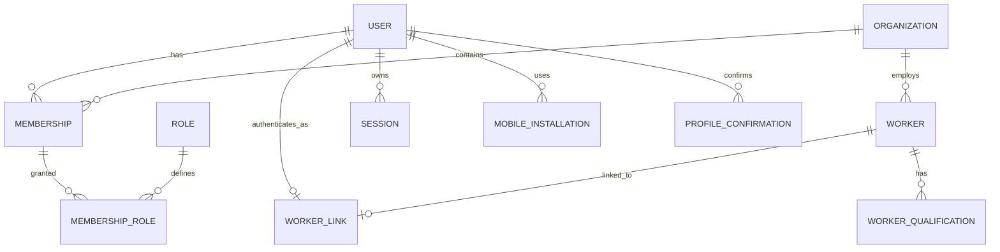
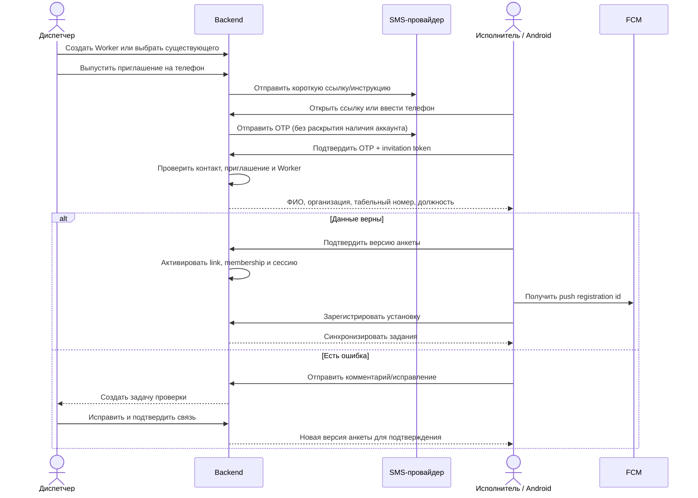
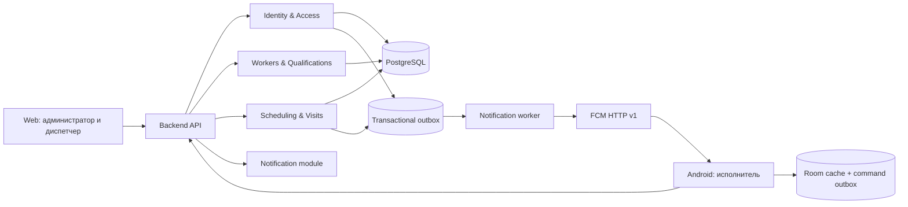
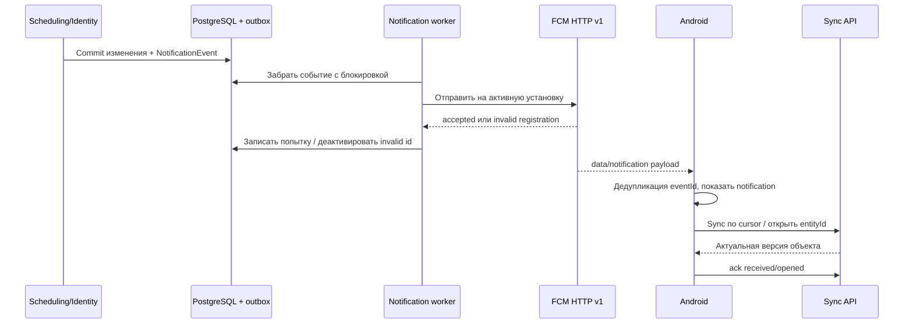

# Ролевая модель, регистрация и Android-приложение исполнителя

Дата проектирования: 19 августа 2026 года.  
Статус: целевая спецификация MVP; допущения, требующие подтверждения, вынесены в `OPEN_QUESTIONS.md`.

FSM-отчётность, геофиксация, фото/видео и внешняя ИИ-проверка вынесены в `FSM_REPORTING_AND_AI.md` как дополнительный модуль для предложения заказчику. Они не входят в обязательный объём этого MVP.

## 1. Границы MVP

В систему входят два клиентских приложения:

- веб-приложение для администратора организации и диспетчера;
- нативное Android-приложение для исполнителя.

В MVP мобильное приложение позволяет исполнителю:

- зарегистрироваться по приглашению и подтвердить номер телефона;
- проверить привязанную к нему рабочую анкету или запросить исправление;
- видеть задания и маршрут на текущий день;
- открыть карточку визита и запустить навигацию во внешнем картографическом приложении;
- менять разрешённые статусы визита;
- получать push-уведомления об изменениях заданий и учётной записи;
- работать при кратковременной потере сети и синхронизировать действия после её восстановления.

В MVP не входят FSM-отчётность и AI-верификация, гео-/фото-/видеофиксация, непрерывное фоновое отслеживание геопозиции, самостоятельное назначение исполнителем своих квалификаций, открытая регистрация без приглашения и iOS-клиент.

## 2. Основные принципы

1. **Учётная запись не равна сотруднику.** `User` отвечает за вход, `Worker` — за планирование и квалификации, `Membership` — за доступ пользователя к организации. Задания можно планировать на сотрудника до того, как он установит приложение.
2. **Регистрация только по приглашению.** Роль, организация и карточка исполнителя задаются уполномоченным сотрудником, а не выбираются регистрирующимся пользователем.
3. **Подтверждение контакта не подтверждает личность.** OTP доказывает только доступ к номеру телефона. Рабочая принадлежность подтверждается приглашением, анкетные данные — исполнителем и/или диспетчером, квалификации — только организацией.
4. **Авторизация выполняется на сервере.** Мобильное и веб-приложения могут скрывать недоступные действия, но не являются источником прав.
5. **RBAC дополняется контекстными ограничениями.** Одной роли `performer` недостаточно: исполнитель может читать только назначенные ему визиты, а диспетчер — только данные своей организации.
6. **Push — сигнал об изменении, а не источник данных.** После уведомления приложение получает актуальное состояние через API. Потеря, повтор или нарушение порядка push-сообщений не должны ломать бизнес-процесс.
7. **Все чувствительные изменения аудируются.** Фиксируются субъект, организация, действие, объект, старое и новое значение, время, причина и идентификатор сессии.

## 3. Сущности доступа



### 3.1. Разделение сущностей

| Сущность | Назначение | Важные поля |
|---|---|---|
| `users` | Глобальная учётная запись | `id`, нормализованный телефон/email, статусы подтверждения контактов, `status` |
| `organizations` | Контур изоляции данных | `id`, название, `status` |
| `memberships` | Принадлежность пользователя организации | `user_id`, `organization_id`, `status`, `authorization_version` |
| `membership_roles` | Роли в конкретной организации | `membership_id`, `role_code`, кто и когда назначил |
| `workers` | Исполнитель как ресурс планировщика | ФИО, табельный номер, телефон, база, график, `identity_profile_version`, `status` |
| `worker_links` | Проверенная связь `User ↔ Worker` | `status`, основание, кто подтвердил, время |
| `worker_qualifications` | Навыки, уровни и допуски | источник, период действия, `verification_status`, кто проверил |
| `invitations` | Одноразовое приглашение | адресат, роль, `worker_id`, хэш токена, срок, состояние |
| `profile_confirmations` | Подтверждение версии анкеты | `worker_id`, версия, результат, замечание, время |
| `sessions` | Серверные сессии | семейство refresh-токенов, устройство, срок, время отзыва |
| `mobile_installations` | Установка приложения и push-адрес | provider, registration id, app/device metadata, разрешение уведомлений, last seen, active |
| `audit_log` | Неизменяемый журнал | субъект, действие, объект, diff, причина, IP/device, время |

Телефон хранится в едином нормализованном формате. Одновременно активная связь с номером должна быть уникальной. Исходный OTP, токены приглашений и refresh-токены в базе не хранятся — только стойкие хэши или зашифрованные значения там, где значение требуется восстановить.

## 4. Роли

### 4.1. Роли MVP

| Роль | Для кого | Зона ответственности |
|---|---|---|
| `platform_admin` | Оператор платформы | Создание организаций, аварийная блокировка, поддержка. Не используется в обычной работе организации |
| `org_admin` | Администратор заказчика | Пользователи, роли, справочники, настройки организации, аудит |
| `dispatcher` | Диспетчер/координатор | Исполнители, заявки, план, ручные изменения и связь с клиентом |
| `performer` | Инженер в Android-приложении | Собственные назначения, статусы визитов, анкета и устройства |

Роль `auditor` (чтение и экспорт без изменений) полезна для промышленной версии, но не обязательна для первого MVP. Интеграции получают отдельные сервисные учётные записи со scopes и не маскируются под человеческие роли.

### 4.2. Матрица прав

Обозначения: `✓` — разрешено, `свои` — только собственные данные или назначения, `орг.` — только в своей организации, `—` — запрещено.

Строки с пометкой «доп. FSM» действуют только при отдельном подключении дополнительного модуля и не являются требованиями базового MVP.

| Действие | platform_admin | org_admin | dispatcher | performer |
|---|:---:|:---:|:---:|:---:|
| Создать/заблокировать организацию | ✓ | — | — | — |
| Управлять настройками своей организации | техподдержка | орг. | — | — |
| Пригласить/заблокировать `org_admin` | ✓ | орг. | — | — |
| Пригласить/заблокировать диспетчера | техподдержка | орг. | — | — |
| Создать карточку исполнителя | техподдержка | орг. | орг. | — |
| Пригласить исполнителя | техподдержка | орг. | орг. | — |
| Изменить роль пользователя | ✓ | орг., кроме `platform_admin` | — | — |
| Подтвердить связь User ↔ Worker | техподдержка | орг. | орг. | — |
| Подтвердить квалификации | — | орг. | орг. | — |
| Смотреть заявки и визиты | техподдержка | орг. | орг. | свои |
| Планировать и назначать визиты | — | орг. | орг. | — |
| Принять/отклонить назначение | — | — | — | свои |
| Менять операционный статус визита | техподдержка | орг. | орг. | свои, по state machine |
| Доп. FSM: настроить вид работ и шаблон отчёта | техподдержка | орг. | просмотр | — |
| Доп. FSM: выбрать диспетчера или ИИ-модель | каталог/секреты | орг. | просмотр | — |
| Доп. FSM: создать отчёт и добавить доказательства | — | — | — | свой визит |
| Доп. FSM: принять/вернуть отчёт вручную | — | орг. | для `manual_review` | — |
| Разрешить изменение подтверждённого визита | — | орг. | орг. | — |
| Подтвердить, что клиент уведомлён | — | орг. | орг. | — |
| Читать аудит | техподдержка | орг. | ограниченно | свои события безопасности |
| Управлять мобильными устройствами | техподдержка | орг. | просмотр статуса | свои |

`platform_admin` не получает автоматического постоянного доступа к содержимому всех заявок. Доступ техподдержки к данным организации должен быть временным, обоснованным и аудируемым; для хакатонного MVP допустим упрощённый режим, но граница должна оставаться в модели.

### 4.3. Контекстные правила авторизации

Каждый серверный запрос проверяет одновременно:

1. действительна ли сессия и не заблокирован ли пользователь;
2. активно ли членство и содержит ли оно необходимое право;
3. совпадает ли `organization_id` ресурса с организацией членства;
4. для исполнителя — совпадает ли назначенный `worker_id` с его активной `worker_link`;
5. разрешён ли переход текущим состоянием объекта;
6. не требуется ли дополнительное бизнес-подтверждение.

`organization_id`, `worker_id` и роль из тела запроса не считаются доверенными. Сервер выводит их из сессии и загруженного ресурса. Чужой объект возвращается как недоступный без раскрытия его существования.

Для защищённого решением D-001 визита команда перепланирования проходит только при наличии права `visit:override_client_confirmed` и полей `client_contact_confirmed_at` и `reason`. Изменение и запись аудита выполняются в одной транзакции.

## 5. Жизненные циклы

### 5.1. Учётная запись и членство

Состояния `User`: `pending_contact` → `active` → `blocked` → `deleted`.  
Состояния `Membership`: `invited` → `pending_verification` → `active` → `suspended` → `left`.

Блокировка пользователя отзывает все сессии и push-регистрации во всех организациях. Приостановка членства закрывает доступ только к соответствующей организации.

### 5.2. Приглашение

Состояния: `created` → `sent` → `accepted`; альтернативные конечные состояния — `expired`, `revoked` и `superseded`.

- Токен приглашения случайный, одноразовый и имеет короткий срок жизни.
- Повторная отправка аннулирует предыдущий токен.
- Приглашение привязано к организации, каналу контакта, будущей роли и, для исполнителя, к конкретному `worker_id`.
- При смене телефона диспетчер выпускает новое приглашение; старый номер не перепривязывается автоматически.

### 5.3. Уровни подтверждения данных

| Уровень | Что доказывает | Кто подтверждает | Условие сброса |
|---|---|---|---|
| Контакт | Доступ к телефону/email сейчас | OTP-провайдер | Смена контакта, компрометация, административный сброс |
| Принадлежность | Пользователь связан с карточкой сотрудника организации | Валидное приглашение; при расхождении — диспетчер | Перевод/увольнение, ручной отзыв |
| Анкета | Пользователь ознакомился с конкретной версией ФИО, организации, табельного номера и должности | Исполнитель | Изменение любого подтверждаемого поля повышает `identity_profile_version` |
| Квалификация | Навык или допуск проверен по источнику организации | Диспетчер или `org_admin` | Истечение срока, отзыв, изменение документа |

Активировать членство исполнителя можно, когда контакт подтверждён, приглашение действительно, связь с `Worker` однозначна и текущая версия анкеты подтверждена. Если исполнитель сообщает об ошибке, членство остаётся `pending_verification` до решения диспетчера.

## 6. Регистрация исполнителя

### 6.1. Основной сценарий



Шаги интерфейса:

1. Экран приветствия объясняет, что нужен номер из приглашения.
2. Пользователь принимает условия обработки данных, вводит телефон или открывает App Link.
3. Приложение запрашивает OTP. Ответ сервера одинаков для существующего и неизвестного номера.
4. Пользователь вводит код. После нескольких неверных попыток challenge блокируется; повторная выдача и проверка ограничиваются по номеру, IP и установке.
5. Сервер находит единственное действующее приглашение и показывает минимальную рабочую анкету.
6. Пользователь выбирает «Данные верны» или «Сообщить об ошибке».
7. После активации приложение объясняет пользу уведомлений и только затем запрашивает системное разрешение Android.
8. Установка регистрируется на сервере, выполняется полная синхронизация, открывается экран «Сегодня».

Если приглашение не найдено, приложение не создаёт свободную учётную запись и предлагает обратиться к диспетчеру. Это предотвращает появление неподтверждённых исполнителей и перебор сотрудников по номеру.

### 6.2. Регистрация сотрудников веб-приложения

- Первый `platform_admin` и первый `org_admin` создаются административно, вне публичного интерфейса.
- `org_admin` приглашает диспетчера на корпоративный email.
- Пользователь подтверждает email одноразовым кодом/ссылкой и сведения об организации.
- Для production у административных ролей нужен второй фактор или корпоративный OIDC; выбор провайдера остаётся открытым. Роль нельзя получить изменением параметров клиентского запроса.

### 6.3. Ошибочные и пограничные случаи

| Случай | Поведение |
|---|---|
| OTP истёк | Новый challenge; старый немедленно недействителен |
| Приглашение истекло/отозвано | Вход не активируется, предлагается запросить новое |
| Телефон уже связан с другим Worker | Автоматическая привязка запрещена, задача `identity_conflict` диспетчеру |
| Пользователь исправляет ФИО/табельный номер | Изменение не применяется напрямую; создаётся запрос с исходными и предложенными данными |
| Уволенный сотрудник входит снова | `Membership` и `Worker` неактивны; сессия не выдаётся |
| Переустановка приложения | Новый installation id, повторный вход, старый push-адрес очищается по ответу провайдера или политике устройства |
| Смена телефона | Только через диспетчера с проверкой старой связи и новым OTP |
| Потеря устройства | Пользователь/администратор отзывает установку и все связанные с ней сессии |

Для MVP принимается одно активное мобильное устройство на исполнителя. Вход на новом устройстве отзывает мобильную сессию и push-регистрацию старого; политика должна быть подтверждена владельцем продукта.

## 7. Сессии и защита данных

- Access token короткоживущий (ориентир — 10–15 минут), содержит минимум идентификаторов и `authorization_version`.
- Refresh token случайный, ротируется при каждом обновлении и хранится на сервере в виде хэша. Повторное использование старого токена отзывает всё семейство.
- На Android refresh token хранится зашифрованно; ключ шифрования создаётся в Android Keystore. OTP, access token и клиентские персональные данные не пишутся в логи.
- При блокировке пользователя, членства, смене критической роли или отвязке Worker refresh-сессии отзываются. Критические API дополнительно проверяют актуальный статус на сервере.
- OTP живёт несколько минут, имеет лимит попыток и повторной отправки. В ответах и логах нельзя различить «номер существует» и «номера нет».
- Все API доступны только по TLS. Секрет SMS-провайдера и учётные данные отправителя FCM находятся только на сервере.
- Push payload не содержит адреса клиента, телефона, ФИО, описания проблемы или токенов доступа.
- Локальная база очищается при выходе, отзыве устройства и смене пользователя. На экране блокировки по умолчанию показывается нейтральный текст уведомления.

## 8. API MVP

Имена иллюстрируют границы контракта и могут быть адаптированы к принятому backend-стеку.

### 8.1. Регистрация и сессии

| Метод | Endpoint | Назначение |
|---|---|---|
| `POST` | `/v1/auth/challenges` | Запрос OTP; телефон, invitation token, installation id |
| `POST` | `/v1/auth/challenges/{id}/verify` | Проверка OTP, выдача ограниченной onboarding-сессии |
| `GET` | `/v1/onboarding/context` | Анкета и версия, доступные действия, статус приглашения |
| `POST` | `/v1/onboarding/profile-confirmations` | Подтвердить ровно полученную версию анкеты |
| `POST` | `/v1/onboarding/correction-requests` | Сообщить о расхождении без прямого изменения эталонных данных |
| `POST` | `/v1/auth/token` | Обновить пару токенов с ротацией refresh token |
| `POST` | `/v1/auth/logout` | Отозвать текущую сессию и установку |
| `POST` | `/v1/auth/logout-all` | Отозвать все сессии пользователя |

Onboarding token имеет отдельный узкий scope и не даёт читать заявки до завершения подтверждения.

### 8.2. Устройства и уведомления

| Метод | Endpoint | Назначение |
|---|---|---|
| `PUT` | `/v1/mobile-installations/{installationId}` | Создать/обновить provider registration id, версию приложения и статус разрешения |
| `DELETE` | `/v1/mobile-installations/{installationId}` | Отвязать push и отозвать мобильную сессию |
| `GET` | `/v1/me/mobile-installations` | Показать собственные активные устройства |
| `GET` | `/v1/me/notification-events?cursor=...` | Получить серверный журнал событий для восстановления пропущенных push |
| `POST` | `/v1/me/notification-events/{eventId}/ack` | Зафиксировать `received` или `opened`, идемпотентно |

В модели лучше использовать нейтральное поле `provider_registration_id`, а не встраивать название FCM во все доменные сущности. Это позволит добавить другой Android push-провайдер без миграции бизнес-модели.

### 8.3. Рабочие команды исполнителя

Минимальный контракт:

- `GET /v1/me/schedule?from=&to=&cursor=`;
- `GET /v1/me/visits/{id}`;
- `POST /v1/me/visits/{id}/transitions` с `transition`, `occurredAt`, `clientCommandId`, `expectedVersion`;
- `GET /v1/me/sync?cursor=` для дельта-синхронизации;
- `POST /v1/me/sync/commands` для пачки накопленных offline-команд.

Все изменяющие команды имеют уникальный `clientCommandId`/`Idempotency-Key` и ожидаемую версию объекта. Повтор из-за нестабильной сети не создаёт второе событие, а конфликт версии возвращает актуальное состояние для разрешения на клиенте.

API отчётов, геофиксации и media assets относится к дополнительному FSM-модулю и описан отдельно в `FSM_REPORTING_AND_AI.md`.

## 9. Архитектура решения

### 9.1. Общая схема



Для MVP backend разумно оставить модульным монолитом с одной PostgreSQL: границы модулей важны, отдельные микросервисы — нет. Отправка OTP и push выполняется фоновыми worker-процессами через transactional outbox, чтобы бизнес-изменение не терялось между commit базы и внешним API.

### 9.2. Android-стек

| Область | Решение MVP | Причина |
|---|---|---|
| Язык/UI | Kotlin + Jetpack Compose, single-activity | Нативный Android и современная UI-модель |
| Состояние | ViewModel + StateFlow + UDF | Предсказуемое состояние экранов и тестируемость |
| Навигация | Jetpack Navigation с проверяемыми deep links | Открытие конкретного визита из push |
| DI | Hilt | Единая сборка зависимостей и замена реализаций в тестах |
| Сеть | Retrofit/OkHttp или эквивалент | Типизированный API, interceptors, refresh сессии |
| Локальные данные | Room | Задания, визиты, справочники, sync cursor, очередь команд |
| Настройки | DataStore | Несекретные флаги onboarding и пользовательские настройки |
| Фоновые задачи | WorkManager | Дожим очереди команд и периодическая синхронизация при появлении сети |
| Push | Firebase Cloud Messaging, HTTP v1 на сервере | Быстрый Android MVP с адресной доставкой |
| Секреты | Android Keystore + шифрование токена | Защита ключевого материала от извлечения |
| Логи/ошибки | Структурированные обезличенные логи; crash reporting после отдельного решения | Диагностика без утечки данных |

Версии библиотек фиксируются version catalog и обновляются перед сборкой; отдельные устаревшие Firebase `-ktx`-артефакты не используются, Kotlin API берутся из основных модулей.

### 9.3. Модули Android

Для MVP достаточно одного Gradle application и нескольких feature/core-модулей без избыточной декомпозиции:

```text
app
├── core:model
├── core:network
├── core:database
├── core:auth
├── core:sync
├── core:notifications
├── feature:onboarding
├── feature:today
├── feature:visit
├── feature:notifications
└── feature:profile
```

`core:location`, `core:media` и feature-модули отчётности добавляются только при включении опционального FSM-контура.

- UI не обращается напрямую к API, Room, FCM или DataStore.
- Репозитории объединяют remote/local data sources.
- Room — единственный источник данных для рабочих экранов; синхронизация обновляет Room, а UI наблюдает `Flow`.
- Доменный слой нужен только для повторно используемых или сложных правил: переход статуса визита, слияние синхронизации, проверка доступных действий.
- Сервер остаётся источником истины для ролей, назначений и финальных статусов; локальная база — устойчивый источник отображения на устройстве.

### 9.4. Offline-first

1. После входа приложение получает snapshot и `syncCursor`.
2. Чтение экранов идёт из Room, поэтому список заданий доступен без сети.
3. Действие пользователя сначала записывается в локальную `command_outbox` с UUID, ожидаемой версией и временем устройства.
4. `SyncWorker` отправляет команды при наличии сети; сервер дедуплицирует их.
5. Сервер возвращает принятые события, конфликты и новый cursor.
6. При конфликте серверное состояние имеет приоритет; пользователь получает понятное сообщение, а команда не теряется бесследно.

Критические данные для выполнения уже назначенных визитов доступны offline. Первичная регистрация, получение нового назначения и подтверждение сервером финального результата требуют сети.

## 10. Push-уведомления

### 10.1. Контур доставки



### 10.2. Регистрация установки

- Приложение создаёт собственный случайный `installationId` и получает актуальный registration identifier от FCM SDK.
- После активной аутентификации оно отправляет оба идентификатора серверу вместе с platform, app version, временем и состоянием разрешения уведомлений.
- Изменение registration identifier обрабатывается callback FCM и повторным `PUT`.
- При каждом старте выполняется безопасный upsert, чтобы восстановиться после пропущенного обновления.
- Logout и отзыв устройства деактивируют адрес. Ответ провайдера `UNREGISTERED` также деактивирует его.
- На Android 13+ разрешение `POST_NOTIFICATIONS` запрашивается в контексте, после объяснения пользы. Отказ не блокирует работу приложения; на экране «Сегодня» отображается ненавязчивое предупреждение и остаётся ручная синхронизация.
- Приложение обновляет известный серверу статус разрешения при старте/возврате на экран. Для установки с известным запретом сервер не использует high priority: событие остаётся в серверном inbox и будет получено очередной синхронизацией.

FCM для Android требует Google Play services. В MVP официально поддерживаются устройства с совместимыми Google Play services; при их отсутствии приложение работает без push и явно показывает это состояние. Интерфейс `PushProvider` на backend и `PushRegistrationProvider` на клиенте оставляет возможность добавить альтернативного поставщика.

### 10.3. Типы событий

| Событие | Когда | Канал/приоритет | Collapse key | Deep link |
|---|---|---|---|---|
| `visit.assigned` | Назначен новый визит | `schedule_changes`, high, видимое | `visit:{id}` | `/visits/{id}` |
| `visit.rescheduled` | Изменено время/исполнитель и изменение уже разрешено | `schedule_changes`, high, видимое | `visit:{id}` | `/visits/{id}` |
| `visit.cancelled` | Визит отменён | `schedule_changes`, high, видимое | `visit:{id}` | `/visits/{id}` |
| `route.updated` | Некритичная оптимизация маршрута | normal | `route:{date}` | `/today?date=...` |
| `visit.reminder` | Скоро начало | `reminders`, high только при пользовательском уведомлении | `reminder:{id}` | `/visits/{id}` |
| `profile.action_required` | Нужно исправить/подтвердить данные | `account`, high, видимое | `profile` | `/profile/verification` |
| `account.session_revoked` | Отзыв устройства/сессии | `account`, high, видимое | `security` | `/login` |
| `report.changes_requested` (доп. FSM) | Отчёт возвращён | `reports`, high, видимое | `report:{id}` | `/reports/{id}` |
| `report.accepted` (доп. FSM) | Отчёт принят | `reports`, normal, видимое | `report:{id}` | `/reports/{id}` |

High priority используется только для срочных пользовательских уведомлений, которые действительно отображаются. Служебные сигналы синхронизации имеют normal priority.

События `report.*` подключаются только вместе с дополнительным FSM-модулем и не входят в базовый push-контур MVP.

Пример минимального payload без персональных данных:

```json
{
  "eventId": "01J...",
  "eventType": "visit.rescheduled",
  "entityType": "visit",
  "entityId": "6ee4...",
  "entityVersion": "18",
  "occurredAt": "2026-08-19T07:10:00Z",
  "syncHint": "schedule"
}
```

Локализованный заголовок и нейтральный текст можно положить в notification-часть сообщения для надёжного отображения в фоне, но конкретный адрес и клиент извлекаются только после открытия приложения. `FirebaseMessagingService` обрабатывает foreground/data-сообщения; длительная синхронизация передаётся в WorkManager.

FCM не гарантирует порядок доставки, а отдельные сообщения могут быть свёрнуты или потеряны. Поэтому:

- `eventId` дедуплицируется;
- устаревший `entityVersion` не перезаписывает новый;
- `onDeletedMessages` и запуск приложения инициируют полную/дельта-синхронизацию;
- серверный inbox позволяет восстановить события независимо от push;
- «FCM принял сообщение» не считается подтверждением сотрудника; для важных действий используется явный `ack` или бизнес-переход.

### 10.4. Связь с подтверждёнными визитами

Для D-001 событие `visit.rescheduled` создаётся только после того, как диспетчер подтвердил связь с клиентом и сервер применил новый план. Предложение оптимизатора не меняет мобильный маршрут и не отправляет исполнителю push. Таким образом, исполнитель никогда не видит неутверждённый вариант как действующий.

## 11. Наблюдаемость и аудит

Минимальные метрики:

- количество выданных/успешных/заблокированных OTP без значений телефонов;
- конверсия `invitation sent → contact verified → profile confirmed → active`;
- глубина и возраст transactional outbox;
- FCM accepted/error по типу ошибки и версии приложения;
- число активных/просроченных/отозванных установок;
- задержка `domain event → send accepted`, `event → received/opened` там, где ack возможен;
- глубина мобильной command outbox и число конфликтов синхронизации.

В базовом MVP в аудит попадают выдача/отзыв приглашения, смена роли, активация/блокировка членства, подтверждение/исправление анкеты, проверка квалификации, привязка/отвязка устройства, отзыв сессии и защищённые изменения визита. При включении FSM дополнительно аудируются версии видов работ, настройки внешней проверки и решения по отчётам. OTP, access/refresh tokens, provider registration identifiers и секреты провайдера в аудит не попадают.

## 12. Критерии приёмки MVP

### Доступ

- Исполнитель не может получить чужой визит ни из списка, ни по известному UUID.
- Диспетчер одной организации не видит объект другой организации.
- Роль и `worker_id`, переданные клиентом, не расширяют фактические права.
- После блокировки пользователя или входа на новом устройстве старый refresh token перестаёт работать.
- Изменение подтверждённого визита без полей D-001 отклоняется и не создаёт push.

### Регистрация

- Нельзя активироваться без действующего приглашения и подтверждённого контакта.
- Один OTP нельзя применить дважды; действуют expiry, attempts и rate limits.
- Подтверждается конкретная версия анкеты; одновременное изменение сервером приводит к `version conflict`, а не к подтверждению старых данных.
- Запрос исправления не меняет эталонные ФИО, роль или квалификации автоматически.
- Повторное приглашение и конфликт телефона обрабатываются без создания дубликата Worker.

### Android и push

- Проверены Android 13+ с выданным и отклонённым разрешением, foreground/background/terminated, Doze и нестабильная сеть.
- Новый или обновлённый registration identifier заменяет старый; invalid registration деактивируется.
- Повторный, пропущенный и пришедший не по порядку push не портят локальное состояние.
- Тап открывает разрешённый объект после аутентификации; удалённый или переназначенный объект не раскрывается.
- Накопленная offline-команда отправляется один раз логически, даже если HTTP-запрос повторился.
- На устройстве без Google Play services приложение диагностирует отсутствие push и сохраняет ручную синхронизацию.

### Критерии дополнительного FSM-модуля

Этот подраздел не участвует в приёмке базового MVP и применяется только при отдельном заказе функции.

- Нельзя отправить отчёт без обязательных полей, геофиксаций и полностью загруженных материалов.
- Отправленная ревизия неизменяема; возврат диспетчером создаёт новую ревизию.
- В ручном режиме решение принимает диспетчер. В AI-режиме `accepted` автоматически закрывает задачу, а `not_accepted`/ошибка переводит отчёт диспетчеру; демонстрационная заглушка всегда выбирает эту безопасную ветку.
- Фото/видео переживают offline и перезапуск приложения, а повтор upload/submit не создаёт дубликаты.

## 13. Порядок реализации

### P0 — вертикальный срез

1. `User`, `Worker`, `Membership`, роли и серверные policy-проверки.
2. Создание Worker и приглашение исполнителя диспетчером.
3. OTP, onboarding-сессия, экран проверки анкеты, активация членства.
4. Android: login/onboarding, «Сегодня», карточка визита, один разрешённый переход статуса.
5. Регистрация установки, transactional outbox и push `visit.assigned`.
6. Аудит ключевых действий и интеграционные тесты изоляции.

### P1 — надёжность демо

1. Room snapshot, command outbox, WorkManager и cursor sync.
2. Все события расписания, deep links, notification channels и permission UX.
3. Ротация refresh token, отзыв старого устройства, обработка invalid push registration.
4. Исправление анкеты и интерфейс решения диспетчером.
5. Тесты foreground/background/Doze/offline и панель метрик outbox.

### После MVP

- корпоративный OIDC и обязательный MFA для административных ролей;
- роль аудитора и временный support access;
- второй Android push-провайдер для устройств без Google Play services;
- iOS-клиент;
- проверка документов квалификаций;
- опциональный FSM-модуль: отчёты, геофиксация, фото/видео и диспетчерская приёмка;
- опциональная внешняя AI-верификация через `ReportVerificationProvider`, включая демонстрационную заглушку;
- управляемые устройства, attestation и удалённая очистка;
- фоновая геопозиция, только если она действительно требуется бизнес-процессом и согласована отдельно.

## 14. Официальные технические основания

- [Android architecture recommendations](https://developer.android.com/topic/architecture/recommendations) — UI/data layers, repositories, UDF, ViewModel, Compose.
- [Android offline-first guidance](https://developer.android.com/topic/architecture/data-layer/offline-first) — локальный источник данных, очереди и WorkManager.
- [Android notification runtime permission](https://developer.android.com/develop/ui/compose/notifications/notification-permission) — `POST_NOTIFICATIONS` на Android 13+ и контекстный запрос разрешения.
- [FCM Android setup](https://firebase.google.com/docs/cloud-messaging/android/get-started) — требования к устройству, registration lifecycle и `FirebaseMessagingService`.
- [FCM receive messages](https://firebase.google.com/docs/cloud-messaging/android/receive-messages) — различия foreground/background и `onDeletedMessages`.
- [FCM message collapsing](https://firebase.google.com/docs/cloud-messaging/customize-messages/collapsible-message-types) — отсутствие гарантии порядка и правила collapse keys.
- [FCM registration management](https://firebase.google.com/docs/cloud-messaging/manage-tokens) — обновление, timestamp и очистка невалидных регистраций.
- [FCM Android priority](https://firebase.google.com/docs/cloud-messaging/android-message-priority) — normal/high priority и ограничения фоновой обработки.
- [Firebase SDK dependencies on Google Play services](https://firebase.google.com/docs/android/android-play-services) — зависимость Cloud Messaging от Google Play services.
- [Android Keystore](https://developer.android.com/privacy-and-security/keystore) — неэкспортируемое хранение ключевого материала.
