# Марш! — руководство пользователя

Актуальность: 28 сентября 2026 года. Руководство описывает текущую реализацию веб-диспетчерской и Android-приложения в этом проекте. Доступные действия зависят от прав вашей учётной записи.

Иллюстрации добавлены 29 сентября 2026 года. Скриншоты веб-диспетчерской сделаны в локальной копии приложения; снимки Android взяты из сохранённых проверок приложения и отмечены в подписях. Даты, номера, подразделения и показатели на снимках служат примерами. Для просмотра мелкого текста откройте изображение в полном размере. [Источники иллюстраций](images/user-guide/README.md).

«Марш!» помогает создавать заявки на выездные работы, назначать исполнителей, рассчитывать маршруты и контролировать результаты. Диспетчер работает в браузере, исполнитель — в Android-приложении, администратор настраивает пользователей, справочники и правила планирования.

## Содержание

1. [Первый вход и быстрый старт](#start)
2. [Разделы системы и основные понятия](#navigation)
3. [Создание и изменение заявок](#requests)
4. [Планирование и публикация маршрутов](#planning)
5. [Перепланирование в течение дня](#replanning)
6. [Исполнители и оборудование на день](#workers)
7. [Транспорт](#transport)
8. [Работа исполнителя в Android](#android)
9. [Проблемы и приостановка работы](#problems)
10. [Проверка выполнения и уведомления](#review)
11. [Аналитика и выгрузка отчётов](#reports)
12. [Администрирование](#admin)
13. [Решение типичных проблем](#troubleshooting)
14. [Особенности текущей версии](#limitations)

## 1. Первый вход и быстрый старт

### Веб-диспетчерская

Рабочий экземпляр проекта уже развёрнут на сервере: [открыть веб-диспетчерскую «Марш!»](http://201.24.120.90). До подключения домена он доступен по HTTP через IP-адрес; после настройки домена администратор сообщит новый HTTPS-адрес.

Для тестового входа используйте общую учётную запись:

- **Email:** `demo@marshplan.local`
- **Пароль:** `MarshDemo2026!`

Тестовый пользователь имеет права администратора во всех трёх подразделениях. Это общий демонстрационный стенд: созданные заявки, изменения справочников и настроек будут видны остальным пользователям.

1. Получите у администратора адрес системы, рабочий email и пароль.
2. Откройте адрес в браузере, введите email и пароль, нажмите **«Войти»**.
3. Проверьте подразделение в верхней части экрана.
4. Выберите нужный раздел в левом меню.

Для выхода нажмите круглый значок с инициалами в правом верхнем углу. Его подсказка — **«Выйти»**.

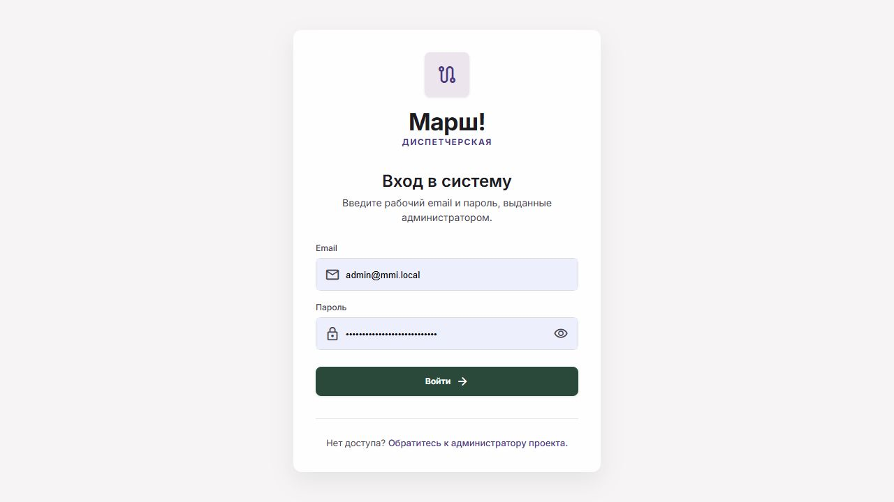

*Рисунок 1. Вход в веб-диспетчерскую. Введите собственные учётные данные, выданные администратором.*

Если вы работаете с локальной копией проекта на Windows, запустите `start-server.cmd` в корне проекта и откройте [локальную диспетчерскую](http://127.0.0.1:3000). Подробности и требования к компьютеру находятся в [инструкции по запуску](../ЗАПУСК.md). Этот адрес работает на компьютере, где запущен сервер; для телефона нужен адрес из [раздела подключения Android](#android).

### Первый рабочий день диспетчера

1. В **«Исполнителях»** проверьте графики, компетенции и транспорт сотрудников.
2. В **«Заявках»** создайте задачи с адресами, составом работ и клиентскими окнами.
3. В **«Планировании»** выберите дату и нажмите **«Пересчитать»**.
4. Проверьте маршруты, список **«Не распределено»** и **«Требуемое оборудование»**.
5. Если меняются подтверждённые визиты, сообщите клиентам об изменениях и отметьте это на экране.
6. Нажмите **«Опубликовать план»**. Дождитесь сообщения об успешной публикации.
7. Зафиксируйте полученные бригадами комплекты оборудования. В течение дня отслеживайте проблемы и отчёты о выполнении.

### Первый рабочий день исполнителя

Подключитесь к серверу, войдите, включите смену в **«Профиле»** и откройте задания на нужную дату. Для каждого визита отметьте выезд и начало работы, затем заполните отчёт и дождитесь его отправки. Пошаговая инструкция приведена в [разделе Android](#android).

## 2. Разделы системы и основные понятия

| Раздел | Для чего используется |
|---|---|
| Планирование | Расчёт маршрутов, проверка распределения, публикация и перепланирование |
| Заявки | Создание и редактирование задач, журнал проблем, проверка результатов |
| Исполнители | Карточки сотрудников и бригад, графики, компетенции, транспорт, оборудование на день |
| Ресурсы | Реестр автомобилей и их состояние |
| Отчёты | Статистика выполненных заявок и экспорт CSV |
| Администрирование | Пользователи, роли, типы заявок, графики и настройки |

**Подразделение** — область работы с заявками, исполнителями, транспортом и графиками. На большинстве экранов выбор в шапке переключает рабочее подразделение. На экране планирования он фильтрует отображаемые маршруты и уведомления: **расчёт, публикация и сводка охватывают все доступные подразделения**, даже если выбран только один фильтр.

**ВК** — верхний уровень типа заявки, например «Подключение» или «Локальная заявка». **HD** — конкретная работа внутри ВК. В один выезд можно включить несколько HD. Исполнитель должен иметь компетенции по каждой выбранной паре ВК–HD.

**Клиентское окно** — интервал, в который можно начать работы. **Плановое начало** — конкретное время визита в расписании. **Норматив обслуживания** — длительность работ без дороги. Например, окно 10:00–12:00 и норматив 60 минут допускают начало в 11:30 и окончание в 12:30, если это укладывается в остальные ограничения графика.

**Черновик плана** — рассчитанное предложение. **Опубликованный план** — применённые назначения. Нажатие **«Пересчитать»** само по себе не меняет действующие назначения.

### Как читать время

В карточке заявки указан её часовой регион; график исполнителя относится к региону исполнителя. Android показывает время региона исполнителя, а при переходе через полночь — также даты. Журнал проблем в веб-диспетчерской показывает время регистрации в **МСК**. Перед изменением времени сверяйте подпись часового пояса.

## 3. Создание и изменение заявок

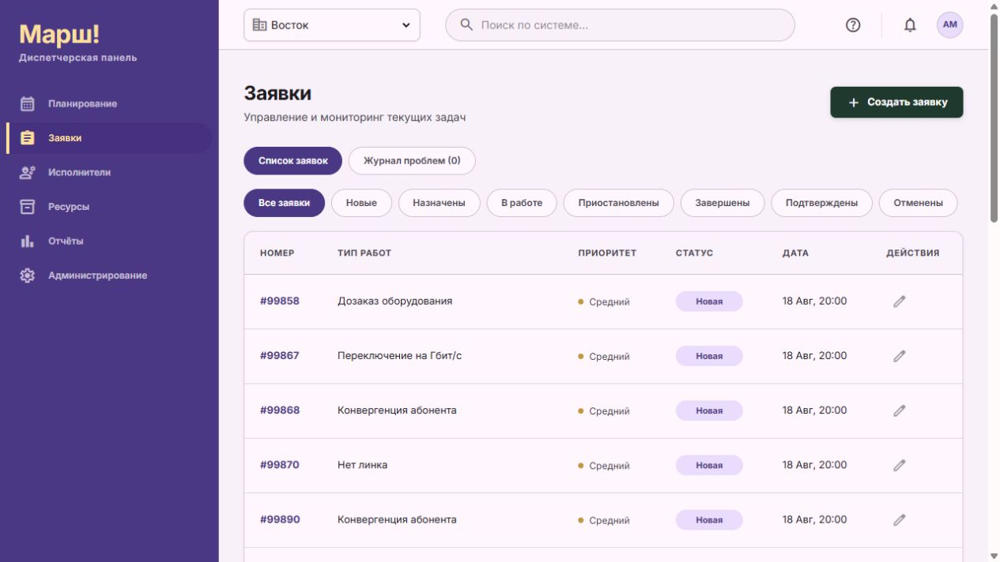

*Рисунок 2. Раздел «Заявки»: подразделение выбирается в шапке, статус — над таблицей. Карточка открывается нажатием на строку.*

### Создать заявку

1. Выберите подразделение, откройте **«Заявки» → «Создать заявку»**.
2. Выберите **«Тип ВК»**, затем отметьте одну или несколько работ в **«Типы HD»**. В форме без выбранного ВК может отображаться прежнее поле **«Тип работ»**.
3. Проверьте норматив. Для нескольких HD заполните **«Общий норматив обслуживания, мин»** и **«Источник общего норматива»**, если они не заполнены подходящими значениями. Общий норматив — от 15 до 480 минут; общие операции выезда учитываются один раз.
4. Проверьте перечень требуемого оборудования, добавьте описание задачи.
5. Выберите приоритет и статус. Для новой задачи без назначения используйте **«Новая»**.
6. Укажите **«Плановое начало работ»** и обе границы клиентского окна. Если окно неизвестно, уточните его перед распределением: длительность работ его не заменяет.
7. Введите адрес и дождитесь сообщения **«Найдено: …»**. Проверьте найденный адрес. Координаты заполняются автоматически и доступны только для чтения.
8. При необходимости укажите **«Адрес здания для маршрута»** без квартиры, а также квартиру или офис, подъезд и домофон в отдельных полях.
9. Оставьте исполнителя неназначенным для автоматического распределения либо выберите подходящего сотрудника для ручного назначения.
10. Нажмите **«Создать заявку»** и проверьте её появление в списке. Номер присваивается автоматически.

Для аварийной работы приоритет становится высоким, а клиентское окно охватывает календарные сутки региона. Признак аварии задаётся в справочнике HD; обычный выбор высокого приоритета не заменяет этот признак.

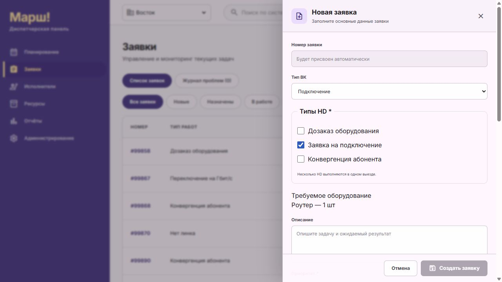

*Рисунок 3. Верхняя часть формы: выбор ВК, работ HD и требуемое оборудование. Остальные обязательные поля находятся ниже. Пример не сохранён.*

### Изменить заявку или назначить вручную

Откройте строку заявки или кнопку редактирования, внесите изменения и нажмите **«Сохранить изменения»**. Список исполнителей учитывает компетенции по выбранным HD.

При ручном назначении проверьте сообщения о пересечении работ и нехватке оборудования. Предупреждение о комплекте допускает ручное назначение, поэтому диспетчер должен отдельно решить, как обеспечить бригаду необходимым оборудованием.

**Ручное сохранение карточки применяется сразу.** Для такого изменения не требуется публикация плана; уже рассчитанный черновик может потребовать пересчёта.

### Изменить визит, подтверждённый клиенту

Флажок **«Время визита подтверждено клиенту»** фиксирует договорённость с клиентом. Если вы меняете значимые параметры такого визита, форма запросит подтверждение уведомления клиента.

1. Согласуйте новое время, исполнителя, адрес или отмену.
2. Отметьте **«Я сообщил клиенту об этих изменениях»**.
3. Сохраните карточку.

Если после отметки вы снова измените параметры визита, потребуется подтвердить уведомление для нового варианта. Установка флажка не отправляет клиенту сообщение автоматически.

### Статусы заявки

| Статус | Значение и следующий шаг |
|---|---|
| Новая | Задача ожидает назначения |
| Назначена | Задача назначена исполнителю; он может перейти к выполнению |
| В пути | Исполнитель отметил выезд; в веб-списке относится к группе «В работе» |
| В работе | Исполнитель выполняет задачу |
| Приостановлена | Исполнитель сообщил о проблеме; для возобновления используется «Продолжить» в Android |
| Завершена | Работа закончена; проверьте наличие и содержание отчёта |
| Подтверждена | Выполнение принято диспетчером либо автоматически по правилам всех HD заявки |
| Отменена | Заявка отменена |

Фильтры над списком помогают выбрать нужный статус. **«Время визита подтверждено клиенту»** и финальный статус **«Подтверждена»** относятся к разным событиям: договорённости о визите и приёмке результата.

## 4. Планирование и публикация маршрутов

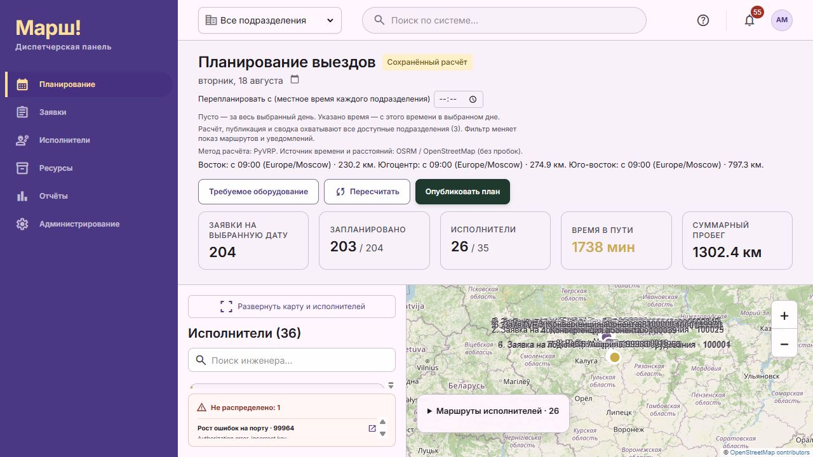

*Рисунок 4. Экран планирования с сохранённым расчётом. Вверху — дата и действия с планом, ниже — сводка, исполнители и карта. Фильтр подразделения меняет отображение, а расчёт и публикация охватывают все доступные подразделения.*

### Рассчитать день

1. Откройте **«Планирование»**, выберите дату.
2. Для расчёта всего дня оставьте поле **«Перепланировать с»** пустым.
3. Проверьте указанные на экране метод расчёта и источник времени и расстояний.
4. Нажмите **«Пересчитать»** и дождитесь завершения. На экране отображаются прошедшее время и максимальное ожидание.
5. Проверьте сводку: число запланированных заявок, исполнителей, время в пути и суммарный пробег.
6. Раскройте маршруты исполнителей. Нажатие на заявку открывает её карточку; выбор маршрута исполнителя помогает рассмотреть его на карте.
7. Разберите список **«Не распределено»** и указанные причины. Исправьте исходные данные и повторите расчёт, если это требуется.
8. Откройте **«Требуемое оборудование»**, проверьте потребность по исполнителям и заявкам.

Расчёт учитывает ограничения заявок и исполнителей. Наличие свободного сотрудника само по себе не гарантирует назначения: важны компетенции, клиентское окно, рабочие часы, перерыв, время дороги и оборудование после выезда.

### Опубликовать

1. Проверьте итоговый черновик, в том числе изменения по всем подразделениям.
2. Если показан блок **«Сообщите клиентам об изменениях»**, свяжитесь с каждым указанным клиентом и отметьте соответствующий визит.
3. Нажмите **«Опубликовать план»**.
4. Дождитесь сообщения **«План … опубликован»** и статуса **«План опубликован»**.

До успешной публикации продолжают действовать прежние назначения. Исполнитель получит обновлённое расписание после синхронизации Android.

Если исходные заявки, статусы, параметры исполнителей или общие настройки изменились после расчёта, публикация устаревшего черновика может быть отклонена. Пересчитайте план, повторно проверьте изменения и согласования.

Состояние **«Сохранённый расчёт»** предназначено для просмотра сохранённого результата. В нём публикация недоступна; для нового применения выполните актуальный расчёт.

## 5. Перепланирование в течение дня

1. Проверьте актуальные статусы заявок и фактически выданное оборудование.
2. Для занятой бригады при необходимости уточните время и место освобождения в карточке исполнителя.
3. В **«Планировании»** выберите дату и укажите **«Перепланировать с»**. Это время применяется как местное время каждого подразделения, а не как единый момент для разных часовых поясов.
4. Нажмите **«Пересчитать»**.
5. Откройте **«До и после пересчёта»**. При необходимости включите **«Показать исходные маршруты на карте»**: серые линии показывают исходную оставшуюся очередь, цветные — новую.
6. Проверьте перенесённые и снятые заявки, нераспределённые задачи и потребность в оборудовании.
7. Уведомите клиентов об изменениях подтверждённых визитов и опубликуйте план.

Заявки **«В пути»** и **«В работе»** защищены от обычного перераспределения. Приостановленные заявки также не перераспределяются оптимизатором. Для оставшейся очереди занятой бригады может потребоваться подтверждённая оценка освобождения.

Линии сравнения показывают варианты маршрута от точки продолжения, а не фактическую историю передвижений. При наличии защищённых заявок показатели распределения и пробега относятся к оставшейся очереди; число исполнителей включает уже занятых.

## 6. Исполнители и оборудование на день

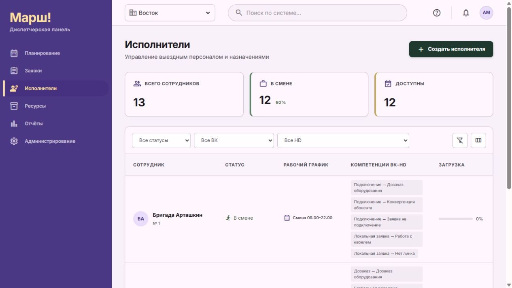

*Рисунок 5. Раздел «Исполнители». Фильтры ВК и HD помогают найти сотрудников с нужными компетенциями.*

### Добавить или изменить исполнителя

1. Выберите подразделение и откройте **«Исполнители» → «Создать исполнителя»** либо существующую карточку.
2. Укажите имя сотрудника или название бригады и, при необходимости, телефон.
3. Для работы через Android выберите **«Пользователь системы»** — учётную запись этого исполнителя.
4. Задайте статус смены и компетенции ВК–HD. Для составной заявки нужны все входящие в неё HD соответствующего ВК.
5. Выберите рабочий график. Если нужного графика нет, администратор создаёт его в настройках.
6. При необходимости укажите собственный адрес начала маршрута и дождитесь определения координат. Пустое поле означает старт от офиса подразделения.
7. Проверьте часовой регион. По умолчанию используется регион подразделения; изменение региона не переносит уже назначенные заявки.
8. Выберите госномер закрепляемого автомобиля либо вариант **«Без автомобиля — общественный транспорт + пешком»**.
9. Нажмите **«Создать исполнителя»** или **«Сохранить изменения»**.

Табельный номер назначается автоматически. Для поиска подходящих сотрудников используйте фильтры статуса, ВК и HD. Доступность в сводке по загрузке не заменяет проверку возможности конкретного назначения.

В списке автомобилей доступны исправные незанятые автомобили подразделения и уже закреплённый автомобиль. При замене прежний автомобиль освобождается.

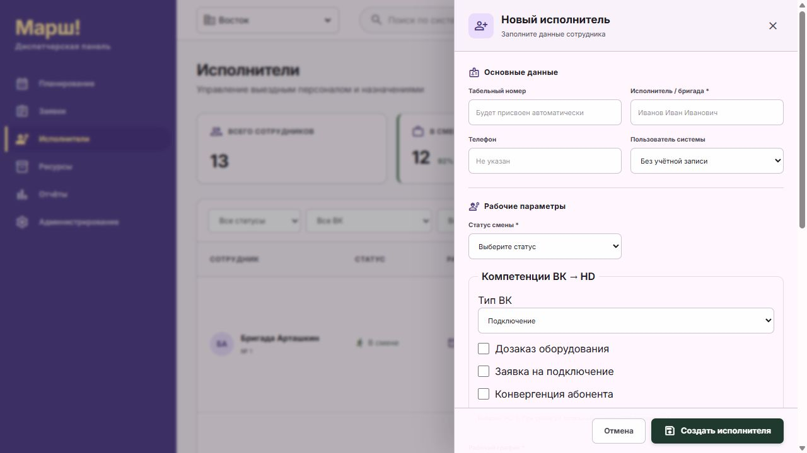

*Рисунок 6. Верхняя часть карточки исполнителя. Связь с учётной записью задаётся в поле «Пользователь системы»; компетенции выбираются в блоке ВК → HD. График и транспорт находятся ниже.*

### Уточнить освобождение занятой бригады

В существующей карточке раскройте **«Уточнить время и место освобождения»**, заполните **«Свободен с»** и **«Адрес продолжения маршрута»**, затем нажмите **«Сохранить доступность»**. Это отдельное сохранение внутри карточки.

Оценка помогает начать оставшийся маршрут с указанного места и времени. После изменения статуса текущей заявки она может устареть — уточните и сохраните её заново. Ненужную оценку можно удалить кнопкой **«Удалить оценку»**.

### Зафиксировать оборудование на день

1. Откройте существующую карточку исполнителя, блок **«Оборудование на день»**.
2. Выберите **«День плана»**.
3. Отметьте фактически полученные виды оборудования.
4. Когда комплект получен и бригада выехала, нажмите **«Комплект получен, бригада выехала»**.
5. Для последующего уточнения измените перечень, укажите причину и нажмите **«Сохранить полученный комплект»**.

До выезда комплект формируется по плану дня. После фиксации выезда перепланирование ограничивается полученным комплектом. Сообщение **«Полученный комплект неизвестен»** означает, что наличие оборудования нужно уточнить.

Система проверяет наличие **видов оборудования**; остатки, расход и количественное обеспечение бригады автоматически не рассчитываются. В сводке **«Требуемое оборудование»** количества показываются по выездам. Пометка «количество не задано» не означает ноль.

## 7. Транспорт

Откройте **«Ресурсы» → «Транспорт»**. Используйте поиск по ТС и фильтры статуса и типа.

Для добавления нажмите **«Добавить ресурс»** и заполните название или модель, тип транспорта, госномер, регион, статус и техническое состояние. При необходимости укажите VIN, исполнителя и примечание. При состоянии **«Требуется обслуживание»** заполните дату следующего ТО. Сохраните ресурс.

Для редактирования откройте карточку автомобиля. В реестре также видны текущее назначение и сведения о заявках опубликованного плана.

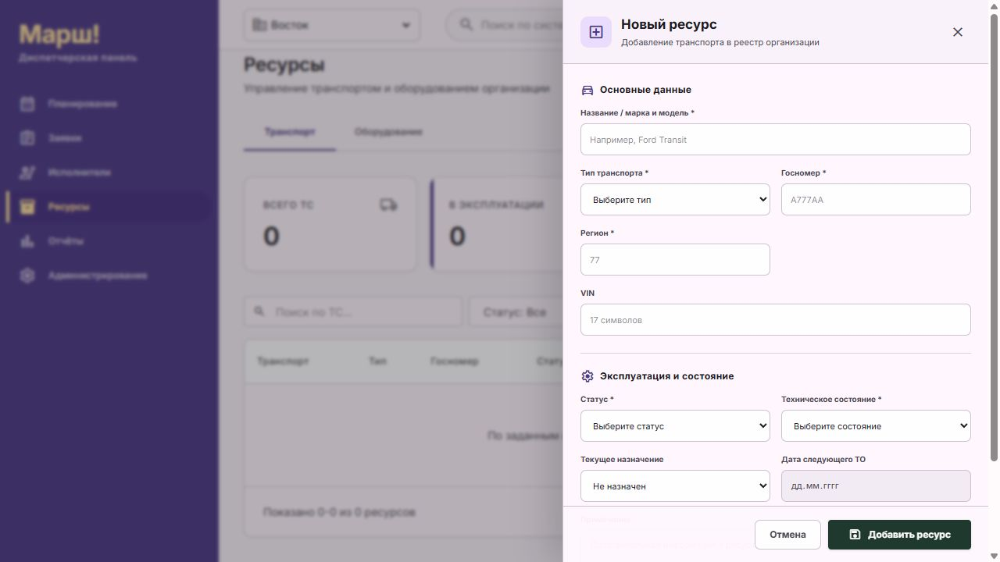

*Рисунок 7. Добавление автомобиля через «Ресурсы» → «Добавить ресурс». Поля со звёздочкой обязательны.*

Отдельная вкладка **«Оборудование»** в разделе ресурсов пока не реализована. Состав оборудования задаётся через **«Администрирование» → «Типы заявок» → «Оборудование ВК»**, а фактический комплект — в карточке исполнителя.

## 8. Работа исполнителя в Android

### Установка и подключение

Требуется Android 8.0 или новее. Получите установочный файл и адрес сервера у администратора. В проекте доступна [тестовая сборка Android 0.4.0](../apps/android/releases/marsh-0.4.0.apk).

1. Установите APK на устройство и откройте «Марш!».
2. На экране входа нажмите **«Связь с сервером»**.
3. Введите выданный администратором адрес, нажмите **«Проверить связь»**, затем **«Сохранить адрес»**.
4. Вернитесь к входу, введите email и пароль, нажмите **«Войти»**.
5. Если открылся экран смены временного пароля, задайте новый пароль длиной 8–128 символов, повторите его, сохраните и войдите снова.

Для входа нужны активная учётная запись, привязка к карточке исполнителя и право **«Выполнение работ»**. Создание только пользователя без карточки исполнителя недостаточно.

Для Android-эмулятора на компьютере с локальным сервером используйте `http://10.0.2.2:3000` либо кнопку **«Локальный сервер для эмулятора»**. На физическом телефоне обычный `localhost` указывает на сам телефон. Для подключения к текущему рабочему серверу используйте `http://201.24.120.90`; после подключения домена используйте выданный администратором HTTPS-адрес. Подключение по USB с перенаправлением порта описано в [технической инструкции Android](../apps/android/README.md).

**«Войти в демо»** открывает учебные задания без сервера. Изменения этого режима остаются на устройстве и не поступают диспетчеру.

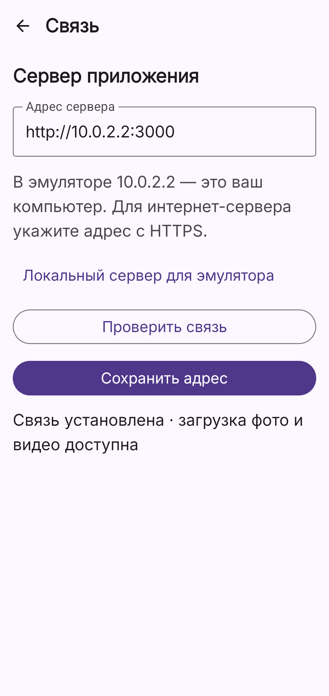

*Рисунок 8. Архивный снимок Android: подключение к локальному серверу из эмулятора. Адрес 10.0.2.2 предназначен для эмулятора; на рабочем телефоне используйте адрес администратора.*

### Выполнить визит

1. В **«Профиле»** включите переключатель смены. Дождитесь синхронизации, если действие поставлено в очередь.
2. На экране **«Сегодня»** выберите нужный день и откройте карточку заявки.
3. Проверьте адрес, план работ, отдельное клиентское окно, ВК, HD и требуемое оборудование.
4. Используйте **«Открыть в навигаторе»** для перехода во внешнее приложение карт.
5. На экране **«Сегодня»** у следующего визита нажмите **«Выехать»**. По прибытии нажмите **«На месте»**, затем в открытой карточке — **«Начать работу»**. Если вы уже на объекте, начало работы также доступно непосредственно из карточки назначенной заявки.
6. После выполнения откройте **«Оформить отчёт»**.

Одновременно допускается один активный визит — **«В пути»** или **«В работе»**. Перед началом другой задачи завершите или приостановите текущую.

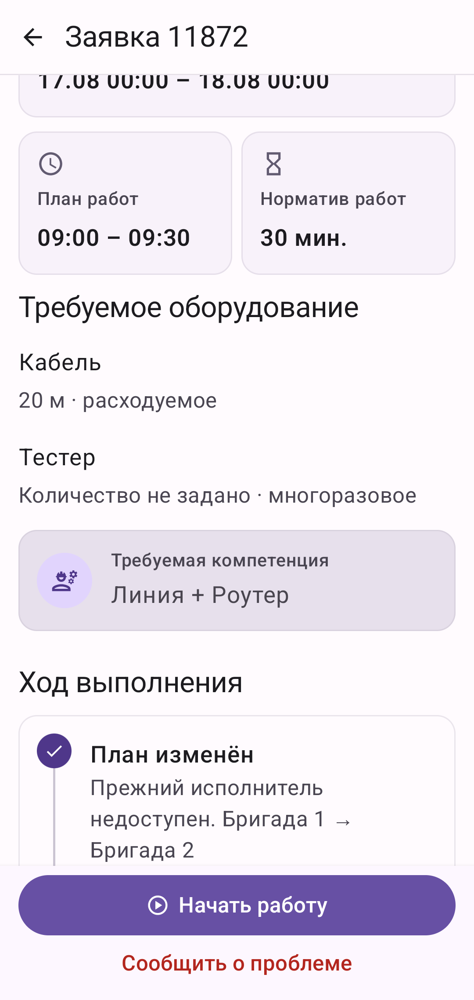

*Рисунок 9. Архивный снимок тестовой карточки Android, прокрученной к деталям. Видны норматив, оборудование, история и действия «Начать работу» / «Сообщить о проблеме». Неуказанное количество оборудования не означает ноль.*

### Оформить и отправить отчёт

1. Заполните обязательные поля каждой HD-работы, отмеченные звёздочкой.
2. В поле **«Результат работы»** опишите выполненные действия и проверенный результат: от 10 до 2000 символов.
3. Добавьте материалы кнопками **«Фото»**, **«Видео»** или **«Выбрать из файлов»**.
4. Проверьте материалы и требования каждой работы к минимальному числу фото и видео.
5. Отметьте **«Работа выполнена, результат проверен»**.
6. Нажмите **«Отправить отчёт и завершить»** и дождитесь подтверждения отправки.

| Ограничение | Значение |
|---|---|
| Всего материалов на выезд | От 1 до 8 |
| Размер фотографии | До 12 МБ |
| Размер видео | До 32 МБ |
| Продолжительность видео | До 60 секунд |
| Форматы при выборе файлов | JPEG, PNG, WebP, MP4, WebM |

Фото и видео общие для выезда, но должны удовлетворять требованиям каждой HD. Например, если одна работа требует две фотографии, а другая — одно видео, приложите как минимум две фотографии и одно видео.

После записи видео подтвердите ролик в системной камере кнопкой подтверждения. Дождитесь сообщения **«Видео добавлено в отчёт»** и появления файла в списке. Просто остановить запись недостаточно.

Черновик текста и материалов сохраняется на устройстве. После отправки результат доступен в карточке через **«Фото, видео и отчёт»**. При ручной проверке дождитесь приёмки диспетчером; при настройке автоматической приёмки для всех HD результат принимается системой.

| Подготовка отчёта | После отправки |
|---|---|
| 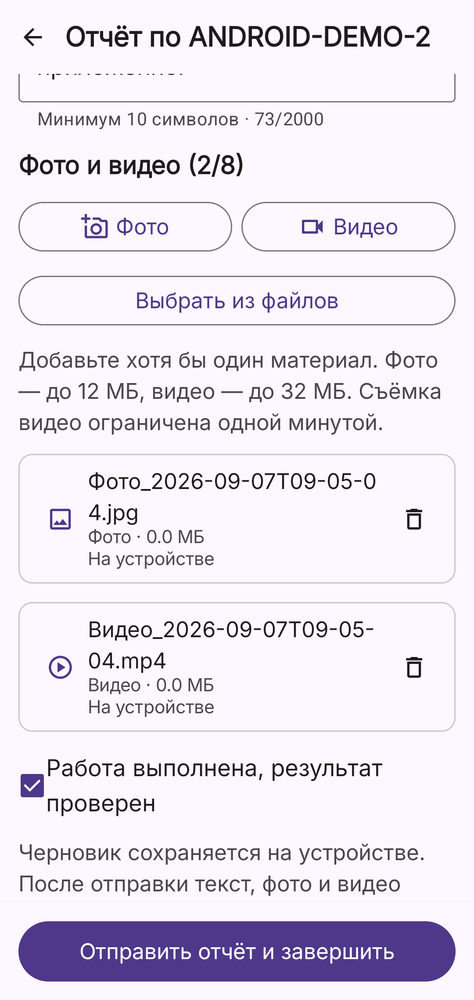 | 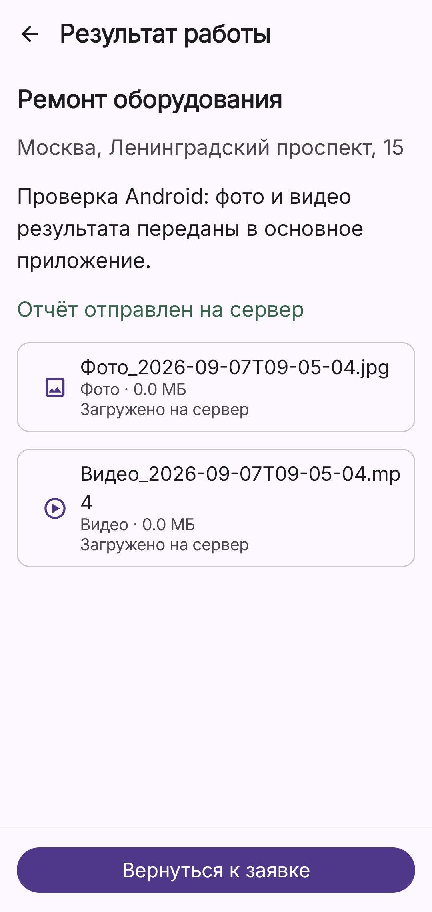 |

*Рисунки 10–11. Архивные снимки тестового отчёта Android. Слева — материалы ещё на устройстве и кнопка отправки; справа — подтверждённая отправка на сервер. Отправка отчёта и его приёмка — разные этапы. Поля отдельных HD в составной заявке располагаются выше списка материалов.*

### Работа без связи

Уже полученное расписание и черновики доступны на устройстве. Действия при потере сети сохраняются в очереди. Надпись **«Отчёт в очереди отправки»** означает, что результат ещё нельзя считать принятым сервером.

1. Восстановите соединение.
2. Откройте **«Профиль» → «Связь»** и нажмите **«Синхронизировать сейчас»** либо **«Повторить отправку»** в форме отчёта.
3. Проверьте сообщение о результате и количество действий в очереди.

При работающем процессе автоматическая синхронизация выполняется примерно каждые 30 секунд. Если процесс приложения остановлен, отправка продолжится при следующем запуске. Для первого входа и получения новых назначений нужна связь с сервером.

Черновики и очередь привязаны к серверу и пользователю. После смены адреса сервера потребуется вход; черновики прежнего подключения остаются привязанными к нему.

Кнопка **«Убрать действия из очереди»** удаляет неотправленные действия после подтверждения. Уже принятые сервером изменения сохраняются, черновики с материалами остаются на устройстве. Используйте её только если действительно хотите отказаться от этих действий; для обычного повтора отправки очищать очередь не нужно.

### Завершить день

Проверьте отправку отчётов и очереди. В **«Профиле»** выключите смену. Завершение смены недоступно, пока есть активный визит «В пути» или «В работе»; приостановленная заявка этому не препятствует.

## 9. Проблемы и приостановка работы

### Исполнителю

1. В карточке назначенной, выполняемой заявки или заявки «В пути» нажмите **«Сообщить о проблеме»**.
2. Выберите причину и заполните описание длиной 5–1000 символов.
3. Нажмите **«Сообщить и приостановить»**.
4. Проверьте подтверждение сервера. Без связи сообщение ожидает синхронизации.

После принятия сообщения заявка получает статус **«Приостановлена»**, а диспетчер видит запись в журнале. Черновик отчёта и материалы сохраняются. Можно перейти к другой задаче или закончить смену.

После устранения причины откройте заявку и нажмите **«Продолжить»**. Для этого нужна открытая смена, действующее назначение и отсутствие другого активного визита. Завершить приостановленную заявку без продолжения нельзя. Приостановленные задания предыдущего дня остаются доступны и при выборе следующего дня.

### Если сообщение о проблеме не отправляется из-за изменения заявки

1. Откройте **«Сегодня» → «Разобрать очередь отправки»** или **«Профиль» → «Связь»**.
2. Нажмите **«Повторить отправку проблемы»**, если это действие предложено.
3. Сверьте актуальные статус, адрес и время заявки, проверьте сохранённый текст.
4. Нажмите **«Отправить и приостановить»**.

Повтор не предлагается, если заявка уже закрыта, приостановлена или снята с исполнителя. В этом случае свяжитесь с диспетчером. Не нужно заново набирать сообщение или очищать очередь для доступного штатного повтора.

### Диспетчеру

Откройте **«Заявки» → «Журнал проблем»** либо фильтр **«Приостановлены»**. По номеру заявки откройте карточку, изучите причину и свяжитесь с исполнителем. Журнал также доступен внутри карточки; на экране планирования приостановленные задачи отмечены в списке исполнителя.

Списки заявок и проблем обновляются примерно каждые 15 секунд и при возвращении в окно. Повторный расчёт маршрутов сам по себе не возобновляет приостановленную работу.

## 10. Проверка выполнения и уведомления

### Принять результат работы

1. В **«Заявках»** выберите фильтр **«Завершены»** и откройте заявку.
2. В блоке **«Отчёт о выполнении»** проверьте исполнителя, время отправки, общий комментарий и поля каждой работы.
3. Просмотрите фото и видео через **«Открыть материал»** или встроенное воспроизведение видео.
4. Если результат соответствует задаче, нажмите **«Подтвердить выполнение»**.
5. Проверьте переход в статус **«Подтверждена»**. На Android результат обновится после синхронизации.

Если показано **«Отчёт ещё не получен»**, исполнитель должен отправить его с телефона. Сообщение **«Учебный пример · файл не загружен»** обозначает демонстрационный материал без реального файла.

Для заявок, у которых у всех HD настроено **«Принимать автоматически»**, заполненный и отправленный отчёт принимается без этой ручной операции. Если автоматическая приёмка настроена не у всех работ, требуется проверка. При замечаниях свяжитесь с исполнителем: отдельный пользовательский сценарий возврата отчёта на доработку в текущем интерфейсе не предусмотрен.

### Уведомления

В веб-диспетчерской нажмите значок колокольчика, чтобы открыть **«Журнал уведомлений»**. Можно открыть связанную заявку, отметить отдельное сообщение прочитанным, выбрать **«Прочитать все»** или загрузить более ранние записи кнопкой **«Ранее»**.

На экране планирования уведомления соответствуют выбранному фильтру подразделений. Открытие уведомления о заявке переключает контекст на её подразделение.

В Android уведомления доступны в соответствующем разделе приложения. Обновляйте данные через синхронизацию: системные push-уведомления пока не подключены.

## 11. Аналитика и выгрузка отчётов

1. Выберите подразделение и откройте **«Отчёты»**.
2. Выберите текущий или предыдущий месяц, текущий квартал, год либо **«Произвольный период»**.
3. Для произвольного периода укажите даты **«С»** и **«По (включительно)»**, нажмите **«Применить»**. Допускается не более 366 дней.
4. Проверьте сводку и распределение по датам, типам работ и исполнителям.
5. При необходимости нажмите **«Обновить»** или **«Экспорт CSV»**.

Отбор производится по **фактической дате завершения** в часовом поясе подразделения. Выполненные заявки включают подтверждённые; каждая заявка считается один раз. Назначенные, приостановленные и отменённые заявки в этот отчёт не входят.

CSV содержит весь выбранный период, а не только текущую страницу таблицы. Если вы поменяли границы периода, сначала примените их — до этого экспорт недоступен. При отсутствии выполненных заявок кнопка экспорта также недоступна.

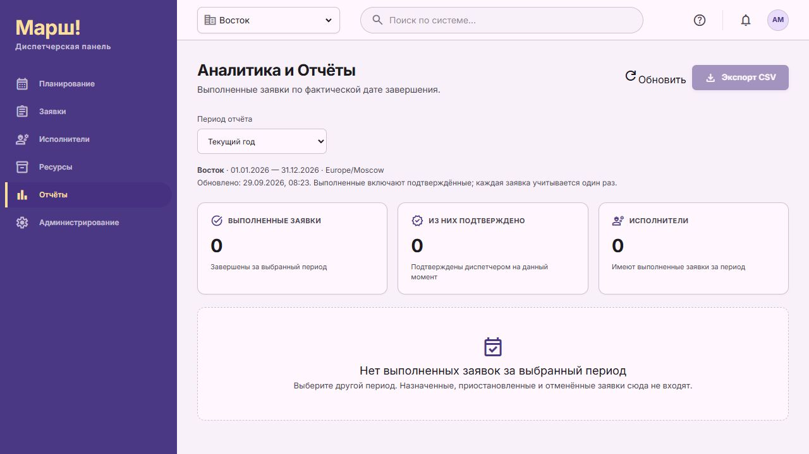

*Рисунок 12. Раздел «Отчёты». На снимке за выбранный период нет выполненных заявок, поэтому экспорт CSV недоступен. Это состояние без данных, а не ошибка загрузки.*

## 12. Администрирование

Для этих операций нужны соответствующие административные права. При первоначальной настройке удобно сначала задать офис и часовой регион, затем графики, типы заявок, пользователей, транспорт и карточки исполнителей.

### Пользователи и роли

В **«Администрирование» → «Пользователи» → «Добавить пользователя»** заполните ФИО, email, роль, статус и временный пароль. Пароль должен содержать не менее 8 и не более 128 символов. Для исполнителя при необходимости оставьте включённым **«Сменить пароль при входе»** — Android поддерживает этот сценарий.

При редактировании поле **«Новый пароль»** можно оставить пустым, чтобы сохранить текущий. Для прекращения доступа установите статус **«Заблокирован»**. Если пользователь забыл пароль, задайте новый в его карточке.

| Роль по умолчанию | Назначение |
|---|---|
| Диспетчер | Заявки, планирование, исполнители, ресурсы и отчёты |
| Исполнитель | Выполнение назначенных задач и мобильные отчёты |
| Администратор | Настройки системы, пользователи, роли и рабочие функции |

Фактические права можно изменить на вкладке **«Роли»**: выберите роль, отметьте доступные действия и пользователей, нажмите **«Сохранить изменения»**. У пользователя одна роль; при переносе из другой роли интерфейс запрашивает подтверждение.

Для мобильной работы дополнительно свяжите пользователя с карточкой в **«Исполнителях»** и проверьте право **«Выполнение работ»**.

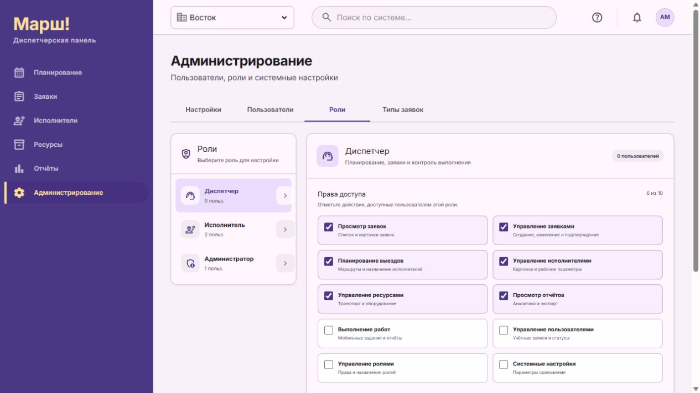

*Рисунок 13. Вкладка «Роли»: слева выбирается роль, справа — её права. На снимке показаны права диспетчера; изменения не выполнялись.*

### Рабочие графики

Откройте **«Настройки»**, блок **«Рабочие графики»**, нажмите **«Добавить»**. Задайте название, рабочие дни, начало и конец работы и при необходимости один перерыв в день. Включите **«График активен»** и нажмите **«Сохранить график»**. Затем выберите график в карточке исполнителя.

### Типы заявок и оборудование

Справочник **«Типы заявок»** общий для всех подразделений.

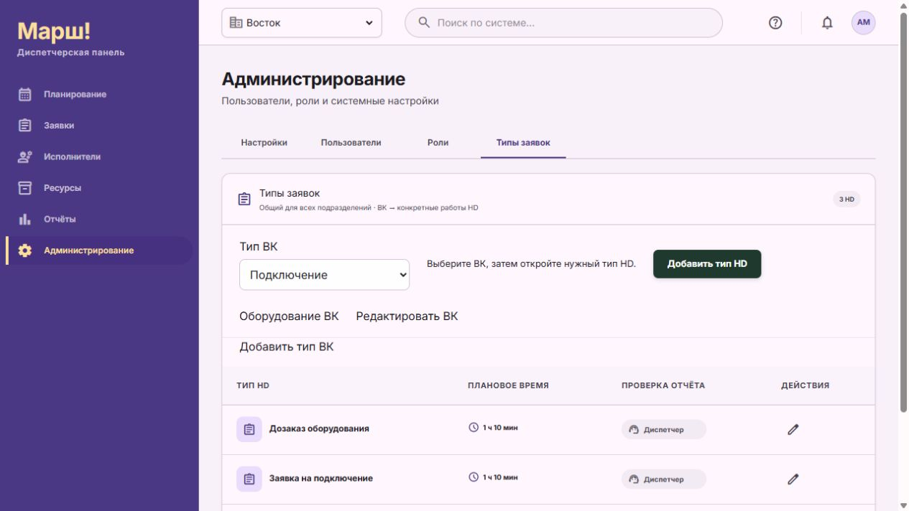

*Рисунок 14. Вкладка «Типы заявок». Сначала выберите ВК, затем откройте HD, добавьте новую работу или перейдите к оборудованию ВК.*

1. Выберите ВК либо нажмите **«Добавить тип ВК»**. Через **«Редактировать ВК»** можно изменить название, описание, норматив без дороги и признак **«Действует»**.
2. Для выбранного ВК нажмите **«Добавить тип HD»** или откройте существующую работу.
3. Укажите связанные ВК, название HD, плановое время и описание. Одна HD может входить в несколько ВК.
4. При необходимости включите признак **«Срочная авария»**.
5. Выберите тип проверки отчёта, добавьте поля отчёта и отметьте обязательные. Можно задать до 20 полей и минимальное количество фото и видео в пределах общего лимита восьми материалов.
6. Сохраните HD.

Чтобы настроить комплект выезда, нажмите **«Оборудование ВК»**. Добавьте позиции из справочника либо создайте **«Новое оборудование»**, укажите единицу измерения, способ использования и количество. После сохранения отдельной позиции сохраните также список оборудования ВК.

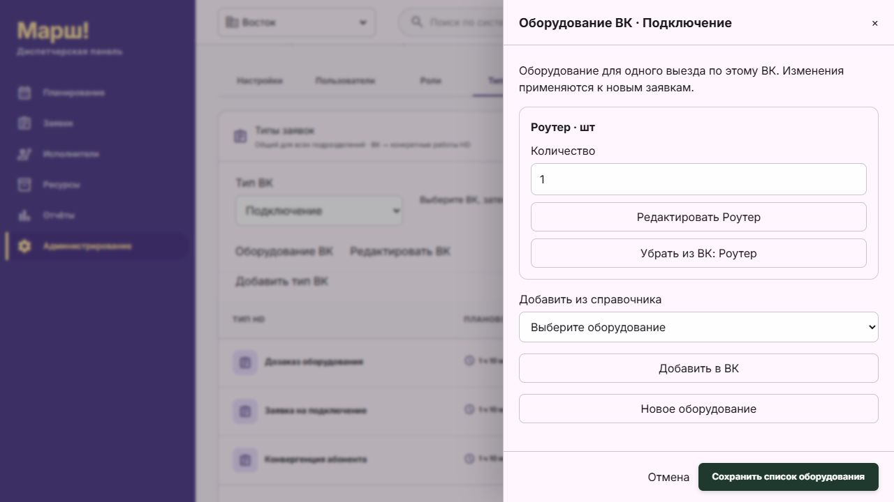

*Рисунок 15. Комплект для одного выезда по выбранному ВК. Кнопка «Сохранить список оборудования» сохраняет состав комплекта.*

Комплект и норматив ВК применяются один раз на выезд, в том числе при нескольких HD. Существующие заявки сохраняют свои ранее зафиксированные составы и правила: изменение справочника не обновляет их задним числом. Изменение названия или единицы общей позиции оборудования отражается в связанных ВК; удаление связи **«Убрать из ВК»** не удаляет её из других ВК и истории заявок.

**«Принимать автоматически»** означает принятие корректно заполненного отчёта после загрузки материалов, без оценки качества диспетчером. Это отдельный режим от ИИ-проверки. Названия **Route Vision v1** и **Quality Control v2** доступны в настройках, но действующий сценарий отправки не выполняет реальную ИИ-проверку: такие отчёты требуют ручного контроля.

### Настройки подразделения и планирования

| Карточка настроек | Область действия |
|---|---|
| Настройки подразделения | Часовой регион и адрес офиса выбранного подразделения |
| Настройки планирования | Общие для всех подразделений: алгоритм, источник дорожных данных, приоритет аварий и лимит расчёта |

У каждой карточки отдельные кнопки **«Сохранить»** и **«Отмена»**. Сохранение одной карточки не сохраняет несохранённые изменения другой.

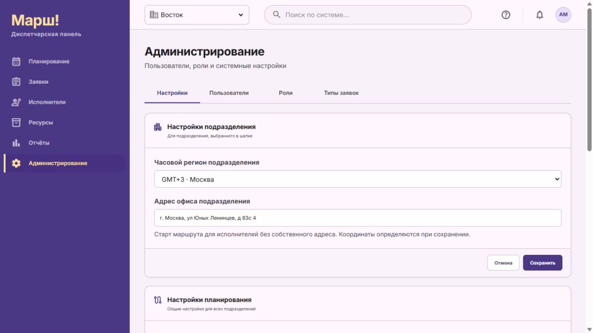

*Рисунок 16. Настройки подразделения. Следующая карточка «Настройки планирования» действует сразу на все подразделения.*

В алгоритмах доступны **PyVRP**, **OR-Tools Routing** и **2ГИС TSP/VRP**. Первые два позволяют выбрать 2ГИС либо OSRM; 2ГИС TSP/VRP работает только с источником 2ГИС и не поддерживает общественный транспорт. Доступность внешних сервисов обеспечивает администратор развёртывания.

Для PyVRP и OR-Tools можно выбрать **«Аварии — как можно раньше»** либо **«Аварии — с минимальным штатом»**. Во втором варианте сокращение числа исполнителей имеет приоритет перед ранним началом аварий после первичных целей распределения.

**«Максимальное время расчёта, с»** задаётся от 30 до 1800 секунд и ограничивает общий расчёт всех подразделений, включая получение дорожных данных. При превышении серверного лимита прежний черновик сохраняется.

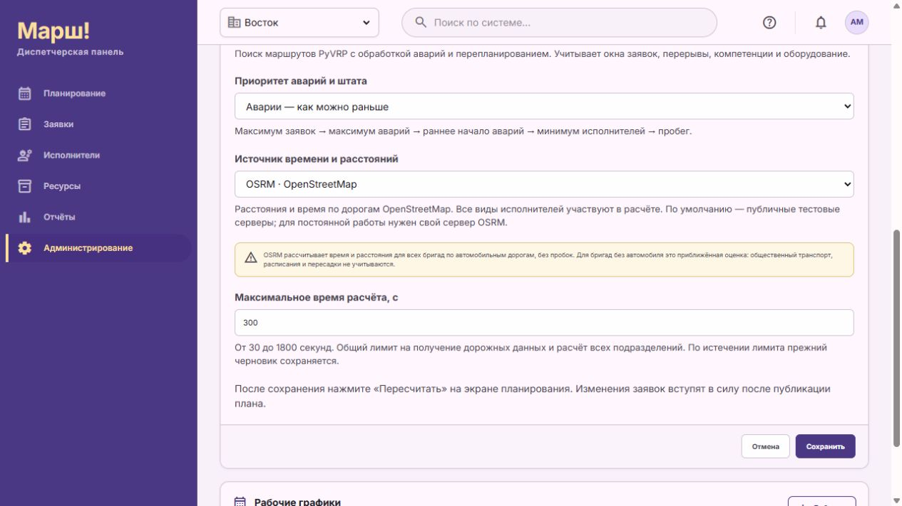

*Рисунок 17. Продолжение карточки общих настроек: источник дорожных данных и лимит расчёта. Значения на снимке показывают текущую локальную настройку, а не обязательные значения для всех установок.*

После изменения настроек выполните **«Пересчитать»**, проверьте результат и опубликуйте план. Общие настройки делают прежние черновики устаревшими, но сами по себе не переписывают действующие назначения.

## 13. Решение типичных проблем

| Ситуация | Что проверить и сделать |
|---|---|
| Не удаётся войти | Проверьте адрес сервера, email, пароль и раскладку. Администратор проверяет статус и права учётной записи |
| Android сообщает об отсутствии доступа | Проверьте связь пользователя с исполнителем и право «Выполнение работ» |
| В Android нет заданий | Проверьте сервер, аккаунт, выбранную дату, назначение исполнителю и публикацию плана; синхронизируйте данные |
| Кнопка сохранения заявки недоступна | Дождитесь определения координат, проверьте обязательные поля и подтверждение уведомления клиента |
| Адрес не найден | Уточните город, улицу и дом; вынесите квартиру в отдельное поле. При повторной ошибке администратор проверяет сервис поиска адресов |
| Нет подходящего исполнителя | Проверьте подразделение и компетенции по всем HD выбранного ВК |
| Заявка не распределена | Прочитайте причину в списке «Не распределено»; проверьте окно, норматив, график, дорогу, компетенции, комплект и оценку освобождения |
| Автомобиля нет в списке | Проверьте подразделение, исправность, ремонт и закрепление за другим исполнителем |
| Расчёт завершился ошибкой | Сохраните текст ошибки, название подразделения и источник расчёта; администратор проверяет доступность сервиса. После исправления повторите расчёт |
| Превышено время ожидания ответа браузером | Обновите страницу и проверьте состояние черновика: не считайте расчёт или публикацию успешными без подтверждения |
| «Опубликовать план» недоступно | Нужен актуальный черновик, завершённый расчёт и отметки уведомления всех затронутых клиентов; сохранённый расчёт для просмотра не публикуется |
| Черновик устарел | Пересчитайте план, проверьте изменения и заново выполните необходимые согласования |
| Нельзя начать другой визит или закончить смену | Завершите или приостановите текущую заявку «В пути» / «В работе»; проверьте очередь синхронизации |
| Кнопка отправки отчёта недоступна | Проверьте статус «В работе», смену, текст от 10 символов, материалы, обязательные поля всех HD и флажок проверки результата |
| Видео не появилось в отчёте | Подтвердите запись в камере, проверьте лимиты 60 секунд и 32 МБ, дождитесь добавления файла |
| Отчёт остался в очереди | Восстановите сеть и выполните синхронизацию в разделе «Связь»; прочитайте причину ошибки |
| Заявка изменилась во время работы | Получите актуальные данные. Для проблемы используйте доступную кнопку повторной отправки; остальные конфликты уточните с диспетчером |
| В аналитике нет заявки | Проверьте подразделение, фактическую дату завершения, часовой пояс и статус; примените период и обновите отчёт |

При обращении к администратору укажите экран, подразделение, дату плана, номер заявки, время возникновения и точный текст ошибки. Это помогает найти нужную запись без повторного выполнения операции.

## 14. Особенности текущей версии

- **OSRM** рассчитывает время по автомобильным дорогам без пробок для всех бригад. Для исполнителей без автомобиля это приближённая оценка: расписания общественного транспорта и пересадки не учитываются.
- Выбор OSRM для маршрутов не отключает зависимость поиска координат адресов от сервиса **2ГИС**.
- Карта маршрутов не является непрерывным отслеживанием геопозиции исполнителя.
- В Android пока нет системных push-уведомлений и гарантированной отправки очереди при остановленном процессе. Откройте приложение для синхронизации.
- При замене администратором всего рабочего набора данных Android очищает прежние задания, черновики, связанные локальные материалы и очередь при получении нового набора. Перед таким обслуживанием согласуйте отправку незавершённых результатов.
- Поле **«Поиск по системе»**, кнопка **«Помощь»** и поиск инженера в боковой панели планирования пока не выполняют поиск или открытие справки. Пользуйтесь разделами, работающими фильтрами и этим руководством.
- Вкладка оборудования в «Ресурсах» и реальная ИИ-проверка отчётов пока не реализованы. Доступные способы работы с оборудованием и приёмкой описаны выше.
- Веб-экраны мобильного прототипа не заменяют Android-приложение для описанного рабочего процесса.

Руководство сверено с формами веб-приложения, экранами Android и серверными правилами обработки заявок, планов и отчётов. Сведения о будущих функциях из проектных требований не трактуются здесь как готовые возможности.

### Связанные инструкции

- [Локальный запуск](../ЗАПУСК.md)
- [Android: подключение и технические сведения](../apps/android/README.md)
- [Проблемы и приостановленные заявки: подробности процесса](PROBLEM_WORKFLOW.md)
